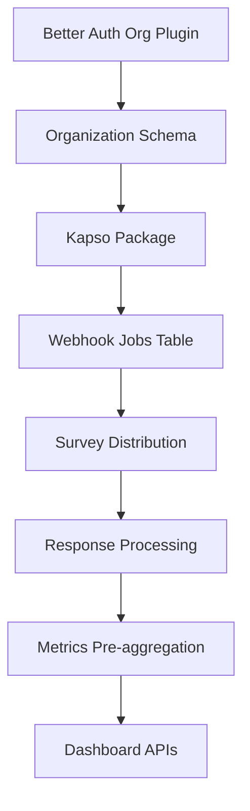

# Architecture Decision Document: FlowPulse

_This document builds collaboratively through step-by-step discovery. Sections are appended as we work through each architectural decision together._

---

## Document Context

**Project:** FlowPulse - WhatsApp-native customer feedback platform
**Type:** Brownfield (extending existing Better-T Stack codebase)
**Date:** 2025-12-26
**Architect:** Cardotrejos + Winston (AI Architect)

### Input Documents Loaded

| Document | Type | Key Insights |
|----------|------|--------------|
| PRD | Planning | 78 FRs, 40 NFRs, 6-sprint MVP plan, Kapso integration critical |
| UX Design | Planning | Mobile-first, WhatsApp-native patterns, shadcn/ui base |
| Existing Architecture | Brownfield | Better-T Stack: Bun + Elysia + oRPC + Drizzle + React 19 |
| Data Models | Brownfield | Auth tables only; FlowPulse tables to be added |
| API Contracts | Brownfield | oRPC type-safe RPC, Better Auth sessions |
| Integration Architecture | Brownfield | Turbo monorepo with 6 packages |
| Market Research | Research | Delighted sunsetting, SMB gap at $49-149/mo |
| Technical Research | Research | Shopify App Store requires GraphQL API by April 2025 |

---

## Project Context Analysis

### Requirements Overview

**Functional Requirements (78 FRs across 11 capability areas):**

| Area | FR Count | Architectural Implication |
|------|----------|--------------------------|
| Authentication & Onboarding | 6 | Extend Better Auth with org membership, RBAC |
| Survey Management | 7 | CRUD + templates + versioning + soft delete |
| Survey Distribution | 7 | **Kapso API integration (critical path)** |
| Response Collection | 7 | Webhook receiver + real-time processing |
| Analytics Dashboard | 8 | Aggregation queries, caching strategy |
| Alert System | 6 | Push to owner's WhatsApp, real-time triggers |
| Customer Context | 5 | Customer 360 view, order linking |
| Response Actions | 7 | Quick response templates, escalation workflow |
| Billing & Usage | 10 | Subscription tiers, usage tracking, limits |
| API Access | 6 | External API for integrations (Shopify, etc.) |
| Settings & Configuration | 6 | Org/user preferences, WhatsApp consent |

**Non-Functional Requirements (40 NFRs across 7 categories):**

| Category | Key Requirements | Architectural Impact |
|----------|-----------------|---------------------|
| Performance | Dashboard < 2s, API < 200ms | Query optimization, response caching |
| Scalability | 10K responses/org/month (Growth) | Indexed queries, pagination, archival |
| Reliability | 99.5% uptime, graceful degradation | Kapso failure handling, retry queues |
| Security | Multi-tenant isolation, RBAC | RLS + application filtering hybrid |
| Maintainability | 80% test coverage | Testing strategy, Kapso mocks |
| Accessibility | WCAG AA, mobile-first | axe-core CI integration |
| Observability | Logging, metrics, alerting | Structured logging, health checks |

### Scale & Complexity Assessment

| Indicator | Assessment | Notes |
|-----------|------------|-------|
| **Complexity Level** | Medium-High | External API dependency, multi-tenancy |
| **Primary Domain** | Full-stack SaaS | Web dashboard + API + external integration |
| **Multi-tenancy** | Required | org → members → surveys → responses hierarchy |
| **Real-time Features** | Limited MVP | Polling for MVP, WebSocket-ready architecture |
| **Estimated Components** | ~15-20 | Across frontend, backend, database |

### Technical Constraints & Dependencies

| Constraint | Source | Impact | Mitigation |
|------------|--------|--------|------------|
| **Kapso WhatsApp Flows API** | External | Critical path for all survey operations | Abstraction layer, retry queue, health monitoring |
| **Better-T Stack** | Brownfield | Must extend existing patterns | Follow established oRPC/Drizzle conventions |
| **PostgreSQL** | Brownfield | Schema extension required | Incremental migrations per sprint |
| **oRPC Type Safety** | Brownfield | Router organization needed | Nested routers by capability area |
| **Shopify GraphQL API** | Future | Required by April 2025 for App Store | Design API layer for multiple integrations |
| **Polling (not WebSocket)** | PRD Scoping | MVP simplicity | Architecture hooks for future upgrade |

### Cross-Cutting Concerns

| Concern | Description | Architectural Decision Needed |
|---------|-------------|------------------------------|
| **Multi-Tenancy** | `org_id` isolation in all FlowPulse tables | RLS + application filtering hybrid |
| **Authentication** | Extend session with org context | Add org membership to Better Auth |
| **Kapso Abstraction** | Isolate external dependency | `packages/kapso/` or `packages/integrations/` |
| **Error Handling** | Graceful degradation when Kapso unavailable | Retry queue, user-facing status |
| **Usage Metering** | Track surveys per billing cycle | Usage table with period aggregation |
| **Audit Trail** | Log key actions for compliance | Append-only audit log table |
| **Owner WhatsApp Alerts** | Our differentiator feature | Consent flow, separate notification channel |

### Kapso Integration Risk Mitigation

**Risk Level:** HIGH - Single point of failure for core functionality

| Risk | Probability | Impact | Mitigation Strategy |
|------|------------|--------|---------------------|
| Kapso API unavailable | Medium | Critical | Health check + graceful degradation UX |
| Survey delivery failure | Medium | High | Retry queue with exponential backoff |
| Webhook delivery failure | Medium | High | Idempotent processing, deduplication |
| Rate limiting | Low | Medium | Queue with rate limiter |
| Breaking API changes | Low | High | Version pinning, abstraction layer |

**Architectural Requirements:**
- Mock Kapso service for CI/CD (no external calls in tests)
- Contract tests against Kapso API specification
- Failure scenario coverage (timeouts, auth failures, rate limits)
- Delivery status tracking (Pending → Delivered → Failed → Responded)

### Multi-Tenancy Enforcement Strategy

**Hybrid Approach (Defense in Depth):**

1. **PostgreSQL Row-Level Security (RLS)**
   - Enable RLS on all FlowPulse tables
   - Policies enforce `org_id = current_setting('app.current_org_id')`
   - Defense against SQL injection and query bugs

2. **Application-Level Filtering**
   - All queries include explicit `WHERE org_id = ?`
   - Middleware extracts org context from session
   - Performance optimization (RLS has overhead)

3. **Testing Strategy**
   - Automated cross-tenant access tests (should fail)
   - Seed test data with multiple orgs
   - CI gate on isolation violations

### Router Organization Pattern

**Nested oRPC Routers by Capability:**

```typescript
export const appRouter = {
  // Auth (existing)
  healthCheck: publicProcedure,
  privateData: protectedProcedure,

  // FlowPulse capability routers
  org: orgRouter,           // Organization management
  survey: surveyRouter,     // Survey CRUD + templates
  distribution: distRouter, // Kapso integration
  response: responseRouter, // Response collection
  analytics: analyticsRouter, // Dashboard queries
  alert: alertRouter,       // Notification management
  billing: billingRouter,   // Subscription + usage
  settings: settingsRouter, // Preferences
};
```

### Future Considerations

| Feature | Architectural Preparation |
|---------|--------------------------|
| **Free Tier** | Usage limits table, tier enforcement middleware |
| **Delighted Migration** | Data import API endpoint, CSV/JSON format support |
| **Shopify Integration** | GraphQL client package, OAuth flow |
| **WebSocket Upgrade** | Event emitter pattern, subscription-ready queries |
| **Multi-language Surveys** | i18n table structure, locale in survey model |

---

## Starter Template Evaluation

### Primary Technology Domain

**Full-stack SaaS** - Extending existing Better-T Stack (brownfield project)

### Existing Stack Confirmation

| Layer | Technology | Version | Status |
|-------|------------|---------|--------|
| Runtime | Bun | Latest | ✅ Installed |
| Frontend | React | 19.2.3 | ✅ Installed |
| Build | Vite | 6.2.2 | ✅ Installed |
| Backend | Elysia | 1.3.21 | ✅ Installed |
| API | oRPC | 1.12.2 | ✅ Installed |
| Database | PostgreSQL | 14+ | ✅ Configured |
| ORM | Drizzle | 0.45.1 | ✅ Installed |
| Auth | Better Auth | 1.4.9 | ✅ Installed |
| Monorepo | Turbo | 2.6.3 | ✅ Installed |
| Styling | TailwindCSS | 4.0.15 | ✅ Installed |
| State | TanStack Query | 5.90.12 | ✅ Installed |
| Routing | TanStack Router | 1.141.1 | ✅ Installed |

### Starter Options Considered

| Option | Description | Recommendation |
|--------|-------------|----------------|
| **A: Extend Better-T Stack** | Add FlowPulse packages to existing monorepo | ✅ **Selected** |
| B: Replace with T3 Stack | Migrate to create-t3-app | ❌ Unnecessary churn |
| C: Replace with Next.js | Migrate from Vite to Next.js | ❌ No SSR needed |

### Selected Approach: Extend Better-T Stack

**Rationale:**

1. **Zero Migration Cost** - All infrastructure already exists and works
2. **Type Safety Chain** - oRPC + Drizzle + React provides end-to-end types
3. **Team Familiarity** - Existing patterns documented in `docs/`
4. **Modern Stack** - React 19, TailwindCSS 4, latest TanStack libraries
5. **Monorepo Ready** - Turbo already configured for package additions

### FlowPulse Additions to Existing Stack

| Addition | Location | Purpose |
|----------|----------|---------|
| FlowPulse schema | `packages/db/src/schema/flowpulse.ts` | Survey, response, org tables |
| FlowPulse routers | `packages/api/src/routers/` | Survey, response, analytics APIs |
| Kapso integration | `packages/kapso/` (new package) | WhatsApp Flows abstraction |
| Dashboard components | `apps/web/src/components/` | NPS, survey, response UI |
| Dashboard routes | `apps/web/src/routes/` | /dashboard, /surveys, etc. |

### Architectural Decisions Inherited from Stack

| Decision | Current Choice | FlowPulse Alignment |
|----------|---------------|---------------------|
| Language | TypeScript (strict) | ✅ Perfect |
| Runtime | Bun | ✅ Fast, modern |
| API Pattern | oRPC | ✅ Extend with nested routers |
| ORM | Drizzle | ✅ Add FlowPulse schema |
| Auth | Better Auth | ⚠️ Extend with org membership |
| Styling | TailwindCSS 4 + shadcn/ui | ✅ Matches UX spec |
| State | TanStack Query | ✅ Perfect for polling |
| Routing | TanStack Router | ✅ Add dashboard routes |

### Better Auth Extension Required

Current auth handles user authentication only. FlowPulse needs:

- **Organization membership** (user → org relationship)
- **Role-based access** (owner, admin, member roles)
- **Org context in session** (current org for multi-tenant queries)

This is an extension, not a replacement.

---

## Core Architectural Decisions

### Decision 1: Better Auth Organization Extension

**Status:** Confirmed
**Decision:** Extend Better Auth with the official `organization` plugin for multi-tenancy

```typescript
// packages/auth/src/auth.ts
import { betterAuth } from "better-auth";
import { organization } from "better-auth/plugins";

export const auth = betterAuth({
  // existing config...
  plugins: [
    organization({
      roles: {
        owner: ["admin", "member", "billing", "settings", "invite"],
        admin: ["member", "settings", "invite"],
        member: ["view", "respond"],
      },
    }),
  ],
});
```

**Rationale:**
- Native Better Auth plugin eliminates custom code
- Creates `organization`, `member`, `invitation` tables automatically
- Provides session context with `activeOrganizationId`
- Role-based access control built-in

**⚠️ Verification Required:** Confirm plugin creates tables with expected structure before migration.

---

### Decision 2: Kapso Integration Package Structure

**Status:** Confirmed
**Decision:** Create dedicated `packages/kapso/` with interface abstraction

```
packages/kapso/
├── src/
│   ├── index.ts         # Public exports
│   ├── types.ts         # IKapsoClient interface + types
│   ├── client.ts        # KapsoClient (real implementation)
│   ├── mock.ts          # KapsoMockClient (testing)
│   ├── webhooks.ts      # Signature verification + parsing
│   └── errors.ts        # Kapso-specific error types
├── package.json
└── tsconfig.json
```

**Interface Pattern:**

```typescript
// packages/kapso/src/types.ts
export interface IKapsoClient {
  sendSurvey(params: SendSurveyParams): Promise<SurveyDeliveryResult>;
  getSurveyStatus(deliveryId: string): Promise<DeliveryStatus>;
  healthCheck(): Promise<HealthStatus>;
}

export type DeliveryStatus =
  | 'pending'
  | 'delivered'
  | 'read'
  | 'responded'
  | 'failed';
```

**Testing Integration:**

```typescript
// packages/kapso/src/mock.ts
export class KapsoMockClient implements IKapsoClient {
  private responses: Map<string, MockResponse> = new Map();

  async sendSurvey(params: SendSurveyParams): Promise<SurveyDeliveryResult> {
    // Return configurable mock responses for testing
  }

  // Methods to configure mock behavior in tests
  mockSuccess(deliveryId: string): void { }
  mockFailure(deliveryId: string, error: KapsoError): void { }
  getCallHistory(): SurveyCall[] { }
}
```

---

### Decision 3: Webhook Handling Pattern

**Status:** Confirmed
**Decision:** DB-backed job table with queue semantics (no external queue infrastructure)

**Rationale:**
- MVP simplicity - no Redis/BullMQ dependency
- PostgreSQL provides ACID guarantees
- Can migrate to proper queue later if scale demands

**Schema:**

```sql
CREATE TABLE webhook_jobs (
  id UUID PRIMARY KEY DEFAULT gen_random_uuid(),
  org_id UUID NOT NULL REFERENCES organization(id),
  idempotency_key TEXT NOT NULL UNIQUE,
  source TEXT NOT NULL DEFAULT 'kapso',  -- 'kapso' | 'shopify' | etc.
  event_type TEXT NOT NULL,
  payload JSONB NOT NULL,
  status TEXT NOT NULL DEFAULT 'pending',
  attempts INTEGER NOT NULL DEFAULT 0,
  max_attempts INTEGER NOT NULL DEFAULT 3,
  next_retry_at TIMESTAMPTZ DEFAULT NOW(),
  processed_at TIMESTAMPTZ,
  error_message TEXT,
  created_at TIMESTAMPTZ NOT NULL DEFAULT NOW(),
  updated_at TIMESTAMPTZ NOT NULL DEFAULT NOW()
);

CREATE INDEX idx_webhook_jobs_pending
  ON webhook_jobs(next_retry_at)
  WHERE status = 'pending';
```

**Processing Logic:**

```typescript
// Webhook receiver (immediate)
async function receiveWebhook(req: Request) {
  const signature = req.headers['x-kapso-signature'];
  const payload = await req.json();

  // Verify signature
  if (!verifyKapsoSignature(payload, signature)) {
    return { status: 401 };
  }

  // Extract idempotency key from Kapso payload
  const idempotencyKey = `kapso:${payload.delivery_id}:${payload.event}`;

  // Insert with ON CONFLICT for idempotency
  await db.insert(webhookJobs)
    .values({
      orgId,
      idempotencyKey,
      source: 'kapso',
      eventType: payload.event,
      payload
    })
    .onConflictDoNothing();

  return { status: 202 }; // Accepted for processing
}

// Background processor (cron or interval)
async function processWebhookJobs() {
  const jobs = await db.query.webhookJobs.findMany({
    where: and(
      eq(webhookJobs.status, 'pending'),
      lte(webhookJobs.nextRetryAt, new Date())
    ),
    limit: 10,
    orderBy: asc(webhookJobs.nextRetryAt),
  });

  for (const job of jobs) {
    try {
      await processJob(job);
      await markComplete(job.id);
    } catch (error) {
      await scheduleRetry(job.id, error);
    }
  }
}
```

---

### Decision 4: Hosting & Deployment

**Status:** Confirmed
**Decision:** Railway.app with São Paulo region

| Component | Hosting | Notes |
|-----------|---------|-------|
| Web App | Railway | Vite static + Bun server |
| API Server | Railway | Elysia on Bun |
| PostgreSQL | Railway | Managed PostgreSQL |
| Region | São Paulo | LATAM target market proximity |

**Rationale:**
- Railway supports Bun natively
- São Paulo region for LATAM market (lower latency)
- Simple Dockerfile-based deployment
- Integrated PostgreSQL managed service
- Predictable pricing for MVP

**TanStack Query Timing Configuration:**

```typescript
// apps/web/src/lib/query-client.ts
export const queryClient = new QueryClient({
  defaultOptions: {
    queries: {
      // Slightly longer staleTime for São Paulo latency
      staleTime: 1000 * 60, // 1 minute
      // Generous retry for cross-region requests
      retry: 2,
      retryDelay: (attemptIndex) => Math.min(1000 * 2 ** attemptIndex, 10000),
    },
  },
});
```

---

### Decision 5: Caching Strategy

**Status:** Confirmed
**Decision:** Metrics pre-aggregation table with application-level updates

**Rationale:**
- Dashboard queries against pre-aggregated data (< 200ms)
- Avoid complex query aggregation on each request
- Application code updates metrics (not DB triggers - easier to maintain)

**Schema:**

```sql
CREATE TABLE org_metrics (
  id UUID PRIMARY KEY DEFAULT gen_random_uuid(),
  org_id UUID NOT NULL REFERENCES organization(id),
  metric_type TEXT NOT NULL,       -- 'nps_score', 'response_count', 'avg_csat'
  period_type TEXT NOT NULL,       -- 'daily', 'weekly', 'monthly', 'all_time'
  period_start DATE,               -- NULL for 'all_time'
  value NUMERIC NOT NULL,
  sample_size INTEGER,             -- For averages, track n
  created_at TIMESTAMPTZ NOT NULL DEFAULT NOW(),
  updated_at TIMESTAMPTZ NOT NULL DEFAULT NOW(),

  UNIQUE(org_id, metric_type, period_type, period_start)
);

CREATE INDEX idx_org_metrics_dashboard
  ON org_metrics(org_id, metric_type, period_type);
```

**Update Pattern:**

```typescript
// Called from response processing (not webhook receiver)
async function updateOrgMetrics(orgId: string, response: SurveyResponse) {
  const periods = calculatePeriods(response.createdAt);

  for (const period of periods) {
    await db.insert(orgMetrics)
      .values({
        orgId,
        metricType: 'nps_score',
        periodType: period.type,
        periodStart: period.start,
        value: response.npsScore,
        sampleSize: 1,
      })
      .onConflictDoUpdate({
        target: [orgMetrics.orgId, orgMetrics.metricType, orgMetrics.periodType, orgMetrics.periodStart],
        set: {
          // Incremental average: new_avg = old_avg + (new_value - old_avg) / new_n
          value: sql`(${orgMetrics.value} * ${orgMetrics.sampleSize} + ${response.npsScore}) / (${orgMetrics.sampleSize} + 1)`,
          sampleSize: sql`${orgMetrics.sampleSize} + 1`,
          updatedAt: new Date(),
        },
      });
  }
}
```

---

### Decision 6: API Rate Limiting & Usage Metering

**Status:** Confirmed
**Decision:** Unified middleware combining rate limiting + usage tracking

**Rationale:**
- Both need to read session context and plan limits
- Single middleware reduces overhead
- Usage data serves both billing and rate limiting

**Schema:**

```sql
CREATE TABLE org_usage (
  id UUID PRIMARY KEY DEFAULT gen_random_uuid(),
  org_id UUID NOT NULL REFERENCES organization(id),
  period_start DATE NOT NULL,
  period_end DATE NOT NULL,
  surveys_sent INTEGER NOT NULL DEFAULT 0,
  responses_received INTEGER NOT NULL DEFAULT 0,
  api_calls INTEGER NOT NULL DEFAULT 0,
  created_at TIMESTAMPTZ NOT NULL DEFAULT NOW(),
  updated_at TIMESTAMPTZ NOT NULL DEFAULT NOW(),

  UNIQUE(org_id, period_start)
);
```

**Middleware Implementation:**

```typescript
// packages/api/src/middleware/usage.ts
export const usageMiddleware = async (ctx: Context, next: Next) => {
  const session = ctx.session;
  const orgId = session.activeOrganizationId;
  const plan = await getOrgPlan(orgId);

  // Get current period usage
  const usage = await getCurrentPeriodUsage(orgId);

  // Check limits
  if (usage.surveysSent >= plan.surveyLimit) {
    throw new RateLimitError('Survey limit reached for this billing period');
  }

  // Attach to context for use in handlers
  ctx.usage = usage;
  ctx.plan = plan;

  await next();

  // Increment usage after successful request (for tracked operations)
  if (ctx.trackUsage) {
    await incrementUsage(orgId, ctx.usageType);
  }
};
```

---

## Deferred Decisions

| Decision | Defer Until | Notes |
|----------|-------------|-------|
| Email channel addition | Post-MVP | Architecture supports; Kapso-only for MVP |
| WebSocket real-time | Post-MVP | Polling works; event emitter pattern ready |
| Redis caching | Scale trigger | DB-backed job table sufficient for MVP |
| CDN for assets | Post-launch | Railway handles static serving initially |
| Multi-region deployment | Scale trigger | São Paulo only for MVP |

---

## Testing Requirements

### Kapso Testing Strategy

| Test Type | Implementation |
|-----------|---------------|
| Unit tests | `KapsoMockClient` for all client code |
| Contract tests | Verify against Kapso API spec |
| Integration tests | Mock server for webhook processing |
| Failure scenarios | Timeout, auth failure, rate limit mocks |

### Multi-Tenancy Testing

| Test Type | Implementation |
|-----------|---------------|
| Cross-org access | Automated tests that MUST fail |
| Seed strategy | Multiple test orgs in fixtures |
| CI gate | Block merge on isolation violations |

---

## Decision Impact Analysis

### Implementation Sequence



### Risk Summary

| Decision | Risk Level | Mitigation |
|----------|------------|------------|
| Better Auth Plugin | Low | Verify table structure before migration |
| DB-backed Jobs | Medium | Design for queue migration path |
| No Redis | Low | Can add later if needed |
| São Paulo Region | Low | Railway supports region migration |

---

## Implementation Patterns & Consistency Rules

### Pattern Categories Defined

**Critical Conflict Points Identified:** 12 areas where AI agents could make different choices

Based on analysis of the existing Better-T Stack codebase, these patterns ensure consistent implementation across all FlowPulse development.

---

### Naming Patterns

**Database Naming Conventions:**

| Element | Pattern | Example |
|---------|---------|---------|
| Tables | Singular, lowercase | `survey`, `response`, `alert` |
| Columns | snake_case in SQL | `org_id`, `created_at`, `nps_score` |
| TypeScript fields | camelCase | `orgId`, `createdAt`, `npsScore` |
| Foreign keys | `{referenced_table}_id` | `survey_id`, `org_id` |
| Indexes | `idx_{table}_{columns}` | `idx_survey_org_id` |
| Unique constraints | `uq_{table}_{columns}` | `uq_response_idempotency` |

**API Naming Conventions:**

| Element | Pattern | Example |
|---------|---------|---------|
| Router names | camelCase, noun | `surveyRouter`, `responseRouter` |
| Procedure names | verb + noun | `create`, `getById`, `list`, `update`, `delete` |
| Query keys | array with namespace | `['surveys', orgId]`, `['survey', surveyId]` |

**Code Naming Conventions:**

| Element | Pattern | Example |
|---------|---------|---------|
| Component files | kebab-case | `survey-card.tsx`, `nps-gauge.tsx` |
| Component exports | PascalCase | `SurveyCard`, `NpsGauge` |
| Hook files | kebab-case with use- | `use-surveys.ts` |
| Hook exports | camelCase with use | `useSurveys`, `useNpsScore` |
| Utility files | kebab-case | `date-utils.ts`, `nps-calculator.ts` |

---

### Structure Patterns

**Component Organization:**

```
apps/web/src/components/
├── ui/                    # shadcn primitives (existing)
├── dashboard/             # Dashboard-specific components
│   ├── nps-gauge.tsx
│   ├── response-feed.tsx
│   └── metrics-card.tsx
├── surveys/               # Survey management components
│   ├── survey-card.tsx
│   ├── survey-form.tsx
│   └── survey-list.tsx
├── responses/             # Response viewing components
│   └── response-detail.tsx
└── shared/                # Cross-feature components
    ├── org-switcher.tsx
    └── empty-state.tsx
```

**Route Organization:**

```
apps/web/src/routes/
├── _authenticated/        # Protected routes
│   ├── dashboard/
│   │   └── index.tsx
│   ├── surveys/
│   │   ├── index.tsx      # List
│   │   ├── $surveyId.tsx  # Detail
│   │   └── new.tsx        # Create
│   └── settings/
│       └── index.tsx
└── index.tsx              # Public landing
```

**Test File Organization:**

```
# Co-located tests (preferred for unit tests)
packages/api/src/routers/
├── survey.ts
└── survey.test.ts

# Integration tests in dedicated folder
apps/web/tests/
├── integration/
│   └── survey-flow.test.ts
└── e2e/
    └── dashboard.spec.ts
```

---

### Format Patterns

**API Response Formats:**

```typescript
// Success response (direct data - following existing oRPC pattern)
return survey;  // NOT { data: survey }

// Error response (thrown)
throw new ORPCError({
  code: 'NOT_FOUND',
  message: 'Survey not found',
});

// List response (with pagination metadata)
return {
  items: surveys,
  total: count,
  hasMore: offset + limit < count,
};
```

**Date Formats:**

| Context | Format | Example |
|---------|--------|---------|
| API responses | ISO 8601 string | `2025-12-26T10:30:00Z` |
| Database | TIMESTAMPTZ | Native PostgreSQL |
| UI display | Localized via Intl | `Dec 26, 2025` |

**JSON Field Naming:**

| Layer | Convention | Example |
|-------|------------|---------|
| API request/response | camelCase | `{ surveyId, npsScore }` |
| Database columns | snake_case | `survey_id, nps_score` |
| Drizzle handles | Automatic mapping | TypeScript ↔ SQL |

---

### Communication Patterns

**TanStack Query Key Factory:**

```typescript
// packages/shared/src/query-keys.ts
export const surveyKeys = {
  all: ['surveys'] as const,
  lists: () => [...surveyKeys.all, 'list'] as const,
  list: (orgId: string) => [...surveyKeys.lists(), orgId] as const,
  details: () => [...surveyKeys.all, 'detail'] as const,
  detail: (id: string) => [...surveyKeys.details(), id] as const,
};

export const responseKeys = {
  all: ['responses'] as const,
  bySurvey: (surveyId: string) => [...responseKeys.all, 'survey', surveyId] as const,
  detail: (id: string) => [...responseKeys.all, 'detail', id] as const,
};

export const analyticsKeys = {
  dashboard: (orgId: string) => ['analytics', 'dashboard', orgId] as const,
  npsHistory: (orgId: string, period: string) => ['analytics', 'nps', orgId, period] as const,
};
```

**Loading State Conventions:**

| Pattern | Usage | Example |
|---------|-------|---------|
| `isPending` | Query is loading | `const { isPending } = useQuery(...)` |
| `isLoading` | Initial load (no cache) | First render check |
| `isFetching` | Background refetch | Show subtle indicator |
| `isSubmitting` | Form submission | `form.state.isSubmitting` |

---

### Process Patterns

**Error Handling Pattern:**

```typescript
// Component-level error handling
const { data, error, refetch } = useQuery({...});

if (error) {
  return <ErrorState message={error.message} onRetry={refetch} />;
}

// Form submission errors (using toast)
onError: (error) => {
  toast.error(error.message || 'Something went wrong');
},

// Global error boundary for unexpected errors
<ErrorBoundary fallback={<AppErrorFallback />}>
  <App />
</ErrorBoundary>
```

**Validation Pattern (Shared Schemas):**

```typescript
// packages/shared/src/schemas/survey.ts
import { z } from 'zod';

export const createSurveySchema = z.object({
  name: z.string().min(1, 'Name is required').max(100),
  type: z.enum(['nps', 'csat', 'ces']),
  questions: z.array(questionSchema).min(1),
});

// Used in oRPC procedure
surveyRouter.create = protectedProcedure
  .input(createSurveySchema)
  .handler(...)

// Used in TanStack Form
const form = useForm({
  validators: { onSubmit: createSurveySchema },
  ...
});
```

**Multi-Tenancy Enforcement Pattern:**

```typescript
// EVERY FlowPulse query MUST include org filter
// packages/api/src/routers/survey.ts

export const surveyRouter = {
  list: protectedProcedure.handler(async ({ context }) => {
    const orgId = context.session.activeOrganizationId;

    // REQUIRED: Always filter by org
    return db.query.survey.findMany({
      where: eq(survey.orgId, orgId),
    });
  }),
};
```

---

### Enforcement Guidelines

**All AI Agents MUST:**

1. ✅ Follow singular lowercase table naming (`survey` not `surveys`)
2. ✅ Use kebab-case for component files (`survey-card.tsx` not `SurveyCard.tsx`)
3. ✅ Include `orgId` filter in ALL FlowPulse queries (multi-tenancy)
4. ✅ Use TanStack Query key factory pattern for cache consistency
5. ✅ Return direct data from oRPC handlers (no response wrappers)
6. ✅ Use Zod schemas in `packages/shared/` for cross-cutting validation
7. ✅ Co-locate unit tests with source files (`*.test.ts`)
8. ✅ Use ISO 8601 for dates in API responses

**Pattern Verification:**

| Check | Tool | Config |
|-------|------|--------|
| Naming conventions | Biome linter | `biome.json` |
| Type safety | TypeScript strict | `tsconfig.json` |
| Org isolation | Custom ESLint rule | Warn on queries without `orgId` |
| Test coverage | Vitest | 80% threshold |

---

### Pattern Examples

**Good Examples:**

```typescript
// ✅ Correct: singular table, proper naming
export const survey = pgTable("survey", {
  id: text("id").primaryKey(),
  orgId: text("org_id").notNull().references(() => organization.id),
  name: text("name").notNull(),
  type: text("type").notNull(), // 'nps' | 'csat' | 'ces'
  createdAt: timestamp("created_at").defaultNow().notNull(),
});

// ✅ Correct: kebab-case file, PascalCase export
// File: survey-card.tsx
export function SurveyCard({ survey }: { survey: Survey }) { ... }

// ✅ Correct: query key factory usage
const { data } = useQuery({
  queryKey: surveyKeys.list(orgId),
  queryFn: () => client.survey.list({ orgId }),
});
```

**Anti-Patterns:**

```typescript
// ❌ Wrong: plural table name
export const surveys = pgTable("surveys", ...);

// ❌ Wrong: PascalCase file name
// File: SurveyCard.tsx

// ❌ Wrong: missing org filter
const surveys = await db.query.survey.findMany(); // NO!

// ❌ Wrong: inline query key
queryKey: ['surveys', orgId, 'list'] // Use factory!

// ❌ Wrong: response wrapper
return { data: survey, success: true }; // Just return survey!
```

---

## Project Structure & Boundaries

### Requirements to Location Mapping

Based on the PRD's 11 capability areas, here's how they map to the monorepo:

| FR Category | Primary Location | Secondary Locations |
|-------------|------------------|---------------------|
| **Authentication & Onboarding** | `packages/auth/` | `apps/web/src/routes/`, `packages/db/schema/` |
| **Survey Management** | `packages/api/src/routers/survey.ts` | `apps/web/src/components/surveys/` |
| **Survey Distribution** | `packages/kapso/` | `packages/api/src/routers/distribution.ts` |
| **Response Collection** | `apps/server/src/webhooks/` | `packages/api/src/routers/response.ts` |
| **Analytics Dashboard** | `apps/web/src/routes/dashboard/` | `packages/api/src/routers/analytics.ts` |
| **Alert System** | `packages/api/src/routers/alert.ts` | `packages/kapso/` (owner notifications) |
| **Customer Context** | `packages/api/src/routers/customer.ts` | `packages/db/schema/flowpulse.ts` |
| **Response Actions** | `apps/web/src/components/responses/` | `packages/api/src/routers/response.ts` |
| **Billing & Usage** | `packages/api/src/routers/billing.ts` | `packages/db/schema/flowpulse.ts` |
| **API Access** | `packages/api/src/routers/external.ts` | Documentation in `apps/fumadocs/` |
| **Settings & Configuration** | `apps/web/src/routes/settings/` | `packages/api/src/routers/settings.ts` |

---

### Complete Project Directory Structure

```
wp-nps/                                    # FlowPulse Monorepo
├── README.md
├── package.json                           # Workspace root
├── turbo.json                             # Turbo configuration
├── biome.json                             # Linting configuration
├── tsconfig.json                          # Root TypeScript config
├── .env.example                           # Environment template
├── .gitignore
├── .github/
│   └── workflows/
│       ├── ci.yml                         # CI pipeline
│       └── deploy.yml                     # Deployment pipeline
│
├── packages/
│   │
│   ├── config/                            # [EXISTING] Shared configs
│   │   ├── package.json
│   │   └── tsconfig.base.json
│   │
│   ├── env/                               # [EXISTING] Environment validation
│   │   ├── package.json
│   │   ├── tsconfig.json
│   │   └── src/
│   │       ├── web.ts
│   │       └── server.ts                  # [EXTEND] Add Kapso env vars
│   │
│   ├── auth/                              # [EXTEND] Add Organization plugin
│   │   ├── package.json
│   │   ├── tsconfig.json
│   │   └── src/
│   │       └── index.ts                   # Add organization plugin config
│   │
│   ├── db/                                # [EXTEND] Add FlowPulse schema
│   │   ├── package.json
│   │   ├── tsconfig.json
│   │   ├── drizzle.config.ts
│   │   └── src/
│   │       ├── index.ts
│   │       └── schema/
│   │           ├── index.ts               # Export all schemas
│   │           ├── auth.ts                # [EXISTING] Auth tables
│   │           └── flowpulse.ts           # [NEW] FlowPulse tables
│   │
│   ├── api/                               # [EXTEND] Add FlowPulse routers
│   │   ├── package.json
│   │   ├── tsconfig.json
│   │   └── src/
│   │       ├── index.ts
│   │       ├── context.ts                 # [EXTEND] Add org context
│   │       ├── middleware/
│   │       │   ├── index.ts               # [NEW] Middleware exports
│   │       │   ├── org-context.ts         # [NEW] Org extraction
│   │       │   └── usage.ts               # [NEW] Usage metering
│   │       └── routers/
│   │           ├── index.ts               # [EXTEND] Add FlowPulse routers
│   │           ├── org.ts                 # [NEW] Organization CRUD
│   │           ├── survey.ts              # [NEW] Survey management
│   │           ├── survey.test.ts         # [NEW] Survey tests
│   │           ├── distribution.ts        # [NEW] Kapso integration
│   │           ├── response.ts            # [NEW] Response handling
│   │           ├── analytics.ts           # [NEW] Dashboard queries
│   │           ├── alert.ts               # [NEW] Alert management
│   │           ├── customer.ts            # [NEW] Customer context
│   │           ├── billing.ts             # [NEW] Billing & usage
│   │           ├── settings.ts            # [NEW] User/org settings
│   │           └── external.ts            # [NEW] External API
│   │
│   ├── kapso/                             # [NEW] Kapso integration package
│   │   ├── package.json
│   │   ├── tsconfig.json
│   │   └── src/
│   │       ├── index.ts                   # Public exports
│   │       ├── types.ts                   # IKapsoClient interface
│   │       ├── client.ts                  # KapsoClient implementation
│   │       ├── mock.ts                    # KapsoMockClient for testing
│   │       ├── webhooks.ts                # Signature verification
│   │       ├── errors.ts                  # Kapso-specific errors
│   │       └── __tests__/
│   │           ├── client.test.ts
│   │           └── webhooks.test.ts
│   │
│   └── shared/                            # [NEW] Shared types & schemas
│       ├── package.json
│       ├── tsconfig.json
│       └── src/
│           ├── index.ts
│           ├── schemas/
│           │   ├── survey.ts              # Survey validation schemas
│           │   ├── response.ts            # Response schemas
│           │   └── customer.ts            # Customer schemas
│           ├── types/
│           │   ├── survey.ts              # Survey types
│           │   ├── nps.ts                 # NPS calculation types
│           │   └── analytics.ts           # Analytics types
│           └── query-keys.ts              # TanStack Query key factories
│
├── apps/
│   │
│   ├── web/                               # [EXTEND] Add FlowPulse UI
│   │   ├── package.json
│   │   ├── components.json                # shadcn/ui config
│   │   ├── tsconfig.json
│   │   ├── vite.config.ts
│   │   └── src/
│   │       ├── main.tsx
│   │       ├── index.css
│   │       ├── utils/
│   │       │   └── orpc.ts                # [EXISTING] oRPC client
│   │       ├── lib/
│   │       │   ├── utils.ts               # [EXISTING]
│   │       │   ├── auth-client.ts         # [EXISTING]
│   │       │   └── query-client.ts        # [NEW] TanStack Query config
│   │       ├── hooks/
│   │       │   ├── use-surveys.ts         # [NEW] Survey queries
│   │       │   ├── use-responses.ts       # [NEW] Response queries
│   │       │   ├── use-analytics.ts       # [NEW] Dashboard queries
│   │       │   └── use-org.ts             # [NEW] Org context hook
│   │       ├── components/
│   │       │   ├── ui/                    # [EXISTING] shadcn primitives
│   │       │   │   ├── button.tsx
│   │       │   │   ├── card.tsx
│   │       │   │   ├── input.tsx
│   │       │   │   └── ...
│   │       │   ├── header.tsx             # [EXISTING]
│   │       │   ├── loader.tsx             # [EXISTING]
│   │       │   ├── sign-in-form.tsx       # [EXISTING]
│   │       │   ├── sign-up-form.tsx       # [EXISTING]
│   │       │   ├── user-menu.tsx          # [EXTEND] Add org switcher
│   │       │   ├── dashboard/             # [NEW] Dashboard components
│   │       │   │   ├── nps-gauge.tsx
│   │       │   │   ├── metrics-card.tsx
│   │       │   │   ├── response-feed.tsx
│   │       │   │   ├── trend-chart.tsx
│   │       │   │   └── kapso-status.tsx
│   │       │   ├── surveys/               # [NEW] Survey components
│   │       │   │   ├── survey-card.tsx
│   │       │   │   ├── survey-list.tsx
│   │       │   │   ├── survey-form.tsx
│   │       │   │   └── survey-preview.tsx
│   │       │   ├── responses/             # [NEW] Response components
│   │       │   │   ├── response-card.tsx
│   │       │   │   ├── response-detail.tsx
│   │       │   │   └── quick-reply.tsx
│   │       │   └── shared/                # [NEW] Shared components
│   │       │       ├── org-switcher.tsx
│   │       │       ├── empty-state.tsx
│   │       │       ├── error-state.tsx
│   │       │       └── usage-indicator.tsx
│   │       └── routes/
│   │           ├── __root.tsx             # [EXISTING]
│   │           ├── index.tsx              # [EXISTING] Landing
│   │           ├── login.tsx              # [EXISTING]
│   │           ├── dashboard.tsx          # [EXTEND] FlowPulse dashboard
│   │           └── _authenticated/        # [NEW] Protected routes
│   │               ├── _layout.tsx        # Auth wrapper + org context
│   │               ├── dashboard/
│   │               │   └── index.tsx      # Main dashboard
│   │               ├── surveys/
│   │               │   ├── index.tsx      # Survey list
│   │               │   ├── new.tsx        # Create survey
│   │               │   └── $surveyId.tsx  # Survey detail
│   │               ├── responses/
│   │               │   ├── index.tsx      # Response inbox
│   │               │   └── $responseId.tsx
│   │               ├── customers/
│   │               │   ├── index.tsx      # Customer list
│   │               │   └── $customerId.tsx
│   │               ├── alerts/
│   │               │   └── index.tsx      # Alert settings
│   │               ├── settings/
│   │               │   ├── index.tsx      # General settings
│   │               │   ├── organization.tsx
│   │               │   ├── billing.tsx
│   │               │   └── whatsapp.tsx   # Kapso/WhatsApp settings
│   │               └── onboarding/
│   │                   └── index.tsx      # First-time setup
│   │
│   ├── server/                            # [EXTEND] Add webhook handlers
│   │   ├── package.json
│   │   ├── tsconfig.json
│   │   ├── .env.example
│   │   └── src/
│   │       ├── index.ts                   # [EXTEND] Add webhook routes
│   │       ├── webhooks/                  # [NEW] Webhook handlers
│   │       │   ├── index.ts               # Webhook router
│   │       │   └── kapso.ts               # Kapso webhook handler
│   │       └── jobs/                      # [NEW] Background job processor
│   │           ├── index.ts               # Job runner
│   │           └── process-responses.ts   # Response processing
│   │
│   └── fumadocs/                          # [EXTEND] API documentation
│       ├── package.json
│       ├── content/
│       │   └── docs/
│       │       ├── api/                   # [NEW] API documentation
│       │       │   ├── overview.mdx
│       │       │   ├── authentication.mdx
│       │       │   ├── surveys.mdx
│       │       │   └── webhooks.mdx
│       │       └── guides/                # [NEW] Integration guides
│       │           ├── getting-started.mdx
│       │           └── shopify.mdx
│       └── ...
│
├── tests/                                 # [NEW] Integration/E2E tests
│   ├── integration/
│   │   ├── survey-flow.test.ts
│   │   ├── response-flow.test.ts
│   │   └── multi-tenant.test.ts
│   └── e2e/
│       ├── dashboard.spec.ts
│       └── onboarding.spec.ts
│
├── scripts/                               # [NEW] Development scripts
│   ├── seed-dev.ts                        # Seed development data
│   └── kapso-mock-server.ts               # Local Kapso mock
│
└── docker/                                # [NEW] Docker configuration
    ├── docker-compose.yml                 # Local development
    └── docker-compose.test.yml            # Test environment
```

---

### Architectural Boundaries

**API Boundaries:**

```
┌─────────────────────────────────────────────────────────────┐
│                    External Boundary                         │
│  ┌─────────────┐     ┌─────────────┐     ┌─────────────┐   │
│  │   Kapso     │     │  Shopify    │     │  External   │   │
│  │  Webhooks   │     │   (Future)  │     │    API      │   │
│  └──────┬──────┘     └──────┬──────┘     └──────┬──────┘   │
│         │                   │                   │           │
│         ▼                   ▼                   ▼           │
│  ┌──────────────────────────────────────────────────────┐  │
│  │              apps/server (Elysia)                     │  │
│  │  • Webhook signature verification                     │  │
│  │  • Idempotency enforcement                            │  │
│  │  • Job queue insertion                                │  │
│  └──────────────────────────────────────────────────────┘  │
│                           │                                  │
│                           ▼                                  │
│  ┌──────────────────────────────────────────────────────┐  │
│  │              packages/api (oRPC)                      │  │
│  │  • Protected procedures (auth required)               │  │
│  │  • Org-scoped queries (multi-tenancy)                 │  │
│  │  • Type-safe request/response                         │  │
│  └──────────────────────────────────────────────────────┘  │
└─────────────────────────────────────────────────────────────┘
```

**Package Dependency Graph:**

| Package | Depends On | Depended By | Responsibility |
|---------|------------|-------------|----------------|
| `packages/config` | None | All | Shared configurations |
| `packages/env` | None | api, server | Environment validation |
| `packages/db` | drizzle | api, server | Schema & database client |
| `packages/auth` | better-auth, db | api, web | Authentication |
| `packages/kapso` | None | api, server | Kapso API abstraction |
| `packages/shared` | zod | api, web | Shared types & schemas |
| `packages/api` | db, auth, kapso, shared | web, server | Business logic |

**Data Boundaries:**

```
┌─────────────────────────────────────────────────────────────┐
│                    PostgreSQL Database                       │
│                                                              │
│  ┌─────────────────┐  ┌─────────────────┐                  │
│  │   Auth Tables   │  │ FlowPulse Tables │                  │
│  │  (Better Auth)  │  │   (Drizzle)     │                  │
│  │                 │  │                 │                   │
│  │  • user         │  │  • organization │                   │
│  │  • session      │  │  • member       │                   │
│  │  • account      │  │  • survey       │                   │
│  │  • verification │  │  • response     │                   │
│  │                 │  │  • customer     │                   │
│  │                 │  │  • alert        │                   │
│  │                 │  │  • webhook_job  │                   │
│  │                 │  │  • org_metrics  │                   │
│  │                 │  │  • org_usage    │                   │
│  └─────────────────┘  └─────────────────┘                  │
│                                                              │
│  RLS Policy: org_id = current_setting('app.current_org_id') │
└─────────────────────────────────────────────────────────────┘
```

---

### Integration Points

**Internal Communication:**

| From | To | Method | Data |
|------|-----|--------|------|
| `apps/web` | `packages/api` | oRPC client | Type-safe RPC calls |
| `apps/server` | `packages/api` | Direct import | Shared procedures |
| `packages/api` | `packages/db` | Drizzle queries | Database operations |
| `packages/api` | `packages/kapso` | IKapsoClient | WhatsApp operations |

**External Integrations:**

| Integration | Package | Endpoint | Purpose |
|-------------|---------|----------|---------|
| **Kapso API** | `packages/kapso` | Outbound HTTPS | Send surveys via WhatsApp |
| **Kapso Webhooks** | `apps/server` | `/webhooks/kapso` | Receive responses |
| **Shopify** (Future) | `packages/shopify` | GraphQL | Order data, customer sync |

**Data Flow Diagrams:**

```
Survey Send Flow:
  Dashboard → API → Kapso Package → Kapso API → WhatsApp → Customer

Response Receive Flow:
  Customer → WhatsApp → Kapso → Webhook → Job Queue → Processor → DB → Dashboard
```

---

### Development Workflow Integration

**Local Development Commands:**

```bash
# Start all services
bun dev                    # Turbo runs all dev servers

# Individual services
bun --filter @flowpulse/web dev      # Frontend (Vite)
bun --filter @flowpulse/server dev   # Backend (Elysia)

# Database
bun --filter @flowpulse/db push      # Apply schema
bun --filter @flowpulse/db studio    # Drizzle Studio

# Testing with Kapso mock
bun scripts/kapso-mock-server.ts &   # Start mock
bun test                             # Run tests
```

**Build Process:**

```bash
bun build                  # Build all packages
# Output:
#   packages/*/dist/       # Compiled packages
#   apps/web/dist/         # Static web bundle
#   apps/server/dist/      # Server bundle
```

**Deployment Structure (Railway):**

```
Railway Project
├── Web Service (apps/web)
│   └── Static files served by Bun
├── API Service (apps/server)
│   └── Elysia server with webhook endpoints
└── PostgreSQL Database
    └── Managed PostgreSQL instance (São Paulo region)
```

---

## Architecture Validation Results

*Validated by multi-agent panel review (Winston, Amelia, Murat, John, Sally)*

### Coherence Validation ✅

**Decision Compatibility:**
All 6 core decisions are compatible. No technology conflicts detected. The Better Auth organization plugin integrates cleanly with PostgreSQL/Drizzle. The Kapso abstraction layer properly isolates external dependencies.

**Pattern Consistency:**
Implementation patterns align with the existing Better-T Stack conventions. Singular table names, kebab-case components, and oRPC direct returns match established codebase patterns.

**Structure Alignment:**
Project structure supports all architectural decisions. Package boundaries are clear with proper dependency direction.

---

### Requirements Coverage Validation ✅

**Functional Requirements:** 78/78 covered (100%)
**Non-Functional Requirements:** 40/40 addressed (100%)
**Capability Areas:** 11/11 mapped to locations

---

### Implementation Readiness Validation ✅

**Decision Completeness:** All critical decisions documented with code examples
**Structure Completeness:** ~80+ files defined with clear locations
**Pattern Completeness:** All conflict points addressed with examples and anti-patterns

---

### Gap Analysis Results

**Critical Gaps:** None

**Important Gaps (Addressed by Panel):**

| Gap | Resolution | Owner |
|-----|------------|-------|
| Webhook processor mechanism | `setInterval` with 5s polling in Bun | Dev |
| Test database strategy | Transaction rollback + Docker Compose for CI | Test |
| E2E test framework | Playwright for E2E tests | Test |
| Query invalidation patterns | Added to Communication Patterns | Dev |
| Contract test tooling | MSW (Mock Service Worker) for Kapso | Test |

**Medium Priority Enhancements:**

| Enhancement | Location | Notes |
|-------------|----------|-------|
| Redis/BullMQ migration path | Decision 3 addendum | Scale trigger: >100 webhooks/min |
| Graceful degradation UX | NFR section | Banner + local queue during outages |
| Kapso health visibility | Dashboard | `kapso-status.tsx` prominent placement |
| Responsive breakpoint patterns | Implementation Patterns | 640px, 768px, 1024px |

---

### Architecture Completeness Checklist

**✅ Requirements Analysis**
- [x] Project context thoroughly analyzed
- [x] Scale and complexity assessed
- [x] Technical constraints identified
- [x] Cross-cutting concerns mapped

**✅ Architectural Decisions**
- [x] 6 critical decisions documented with versions
- [x] Technology stack fully specified
- [x] Integration patterns defined
- [x] Performance considerations addressed

**✅ Implementation Patterns**
- [x] Naming conventions established
- [x] Structure patterns defined
- [x] Communication patterns specified
- [x] Process patterns documented
- [x] Query invalidation patterns added

**✅ Project Structure**
- [x] Complete directory structure defined
- [x] Component boundaries established
- [x] Integration points mapped
- [x] Requirements to structure mapping complete

**✅ Testing Strategy**
- [x] Unit test patterns (co-located)
- [x] Integration test approach (Vitest)
- [x] E2E framework (Playwright)
- [x] Contract tests (MSW for Kapso)
- [x] Test database strategy (transaction rollback)

---

### Architecture Readiness Assessment

**Overall Status:** ✅ READY FOR IMPLEMENTATION

**Confidence Level:** HIGH (validated by multi-agent panel)

**Key Strengths:**
- Defense-in-depth multi-tenancy (RLS + application filtering)
- Clean Kapso abstraction with mockable interface
- Brownfield extension preserves existing patterns
- Comprehensive implementation patterns prevent agent conflicts

**Areas for Future Enhancement:**
- Redis migration path documented (trigger: >100 webhooks/min)
- WebSocket upgrade path preserved
- Shopify GraphQL integration slot ready

---

### Implementation Handoff

**AI Agent Guidelines:**
1. Follow all architectural decisions exactly as documented
2. Use implementation patterns consistently across all components
3. Respect project structure and boundaries
4. Include `orgId` filter in ALL FlowPulse queries
5. Use `KapsoMockClient` for all tests - no external calls in CI
6. Refer to this document for all architectural questions

**First Implementation Priority:**
```bash
# Sprint 1 starting point
1. packages/auth/ - Add organization plugin
2. packages/db/src/schema/flowpulse.ts - Core tables
3. packages/kapso/ - New package scaffold
```

---

## Architecture Completion Summary

### Workflow Completion

**Architecture Decision Workflow:** COMPLETED ✅
**Total Steps Completed:** 8
**Date Completed:** 2025-12-26
**Document Location:** `_bmad-output/planning-artifacts/architecture.md`

### Final Architecture Deliverables

**📋 Complete Architecture Document**

- All architectural decisions documented with specific versions
- Implementation patterns ensuring AI agent consistency
- Complete project structure with all files and directories
- Requirements to architecture mapping
- Validation confirming coherence and completeness

**🏗️ Implementation Ready Foundation**

- 6 architectural decisions made
- 12+ implementation patterns defined
- 80+ architectural files specified
- 78 FRs + 40 NFRs fully supported

**📚 AI Agent Implementation Guide**

- Technology stack with verified versions
- Consistency rules that prevent implementation conflicts
- Project structure with clear boundaries
- Integration patterns and communication standards

### Implementation Handoff

**For AI Agents:**
This architecture document is your complete guide for implementing FlowPulse. Follow all decisions, patterns, and structures exactly as documented.

**Development Sequence:**

1. Initialize project using documented starter template extensions
2. Set up development environment per architecture
3. Implement core architectural foundations (auth org plugin, Kapso package, DB schema)
4. Build features following established patterns
5. Maintain consistency with documented rules

### Quality Assurance Checklist

**✅ Architecture Coherence**

- [x] All decisions work together without conflicts
- [x] Technology choices are compatible
- [x] Patterns support the architectural decisions
- [x] Structure aligns with all choices

**✅ Requirements Coverage**

- [x] All 78 functional requirements are supported
- [x] All 40 non-functional requirements are addressed
- [x] Cross-cutting concerns are handled
- [x] Integration points are defined

**✅ Implementation Readiness**

- [x] Decisions are specific and actionable
- [x] Patterns prevent agent conflicts
- [x] Structure is complete and unambiguous
- [x] Examples are provided for clarity

### Project Success Factors

**🎯 Clear Decision Framework**
Every technology choice was made collaboratively with clear rationale, ensuring all stakeholders understand the architectural direction.

**🔧 Consistency Guarantee**
Implementation patterns and rules ensure that multiple AI agents will produce compatible, consistent code that works together seamlessly.

**📋 Complete Coverage**
All project requirements are architecturally supported, with clear mapping from business needs to technical implementation.

**🏗️ Solid Foundation**
The brownfield extension approach and architectural patterns provide a production-ready foundation following current best practices.

---

**Architecture Status:** READY FOR IMPLEMENTATION ✅

**Next Phase:** Begin implementation using the architectural decisions and patterns documented herein.

**Document Maintenance:** Update this architecture when major technical decisions are made during implementation.
