# UX Design Specification: FlowPulse

**Author:** Cardotrejos
**Date:** 2025-12-26

---

## Project Context

**Product:** FlowPulse - WhatsApp-native customer feedback platform
**Target Users:** SMB e-commerce businesses, especially in LATAM markets
**Pricing:** $49-149/mo SaaS
**Key Differentiator:** WhatsApp-native NPS/CSAT/CES surveys with 5x response rates

---

## Executive Summary

### Project Vision

FlowPulse is a WhatsApp-native customer feedback platform that delivers NPS, CSAT, and CES surveys directly inside WhatsApp conversations. The core value proposition is 5x higher response rates than email surveys, achieved by meeting customers where they already are.

**Target Market:** SMB e-commerce businesses, especially in LATAM/WhatsApp-dominant markets
**Price Point:** $49-149/mo (underserved SMB segment)
**Competitive Position:** WhatsApp-ONLY, not "also WhatsApp" - own the channel completely

### Target Users

**Primary Persona: Derek (E-commerce Owner)**
- 400+ orders/month via WhatsApp Business catalog
- LATAM-based, WhatsApp-native for transactions
- Core pain: Low-information returns and silent dissatisfaction
- Quote: "I burned 15,000 pesos changing my recipe based on a GUESS"
- Tech comfort: Moderate - needs simple setup, checks phone constantly

**Secondary Personas:**
- Maria (Restaurant): Multi-location, needs real-time feedback before Yelp reviews
- Priya (Fitness): Subscription business, needs pattern detection for churn prevention

### Key Design Challenges

1. **10-Minute Setup** - SMB owners have limited time; onboarding must deliver value fast
2. **WhatsApp-First Mental Model** - Alerts and notifications should go TO WhatsApp, not email
3. **Mobile-First Dashboard** - Derek checks NPS while managing orders on his phone
4. **Multi-Tenant Complexity** - Org → members → connections → surveys → responses hierarchy
5. **Power vs Simplicity** - Templates for quick start, builder for customization

### Design Opportunities

1. **"Crisis Averted" Moments** - Visualize saves (detractor → resolved) as shareable wins
2. **Response Rate Proof** - Show "5x better than email" with real comparative data
3. **WhatsApp Dogfooding** - Send detractor alerts to owner's WhatsApp (use our own product)
4. **Delighted Migration** - Simple, clean UI that feels familiar to Delighted refugees

---

## Core User Experience

### Defining Experience

**Core User Action:** Quick status check - "What's happening with my customers?"

Derek's primary interaction is a 30-second mobile check between orders:
- Current NPS score (up/down indicator)
- Any detractor alerts needing attention
- Response count and trends
- Quick win celebrations

This is NOT a power-user analytics dashboard. It's a pulse check.

### Platform Strategy

| Platform | Priority | Experience |
|----------|----------|------------|
| Mobile Web | Primary | Thumb-friendly, glanceable dashboard |
| Desktop Web | Secondary | Setup, survey builder, deep analytics |
| WhatsApp Notifications | Critical | Detractor alerts sent to owner's WhatsApp |

**Design Decision:** Mobile-first. Every feature must work perfectly on a phone screen.

### Effortless Interactions

- **WhatsApp Connection:** Scan QR code like WhatsApp Web, done in 60 seconds
- **First Survey:** Pick template → test on yourself → send to customers (under 5 min)
- **Daily Check:** Open → see NPS → see alerts → done in 30 seconds
- **Detractor Response:** Tap notification → see customer context → take action

### Critical Success Moments

1. **First Response:** Customer completes survey within 10 minutes of setup
2. **Rate Revelation:** "5x better than email" shown with real comparative data
3. **Crisis Averted:** Detractor alert → quick response → saved customer relationship
4. **Trend Victory:** NPS moving up after implementing feedback

### Experience Principles

1. **Glanceable > Comprehensive** - Answer in 3 seconds, not 30
2. **WhatsApp-Native Thinking** - Everything feels like WhatsApp
3. **Mobile-First, Desktop-Capable** - Design for thumb, enhance for mouse
4. **Show the Win** - Make success visible and shareable
5. **10-Minute Time-to-Value** - First response before interest fades

---

## Desired Emotional Response

### Primary Emotional Goals

| Emotion | Why It Matters | Design Implication |
|---------|----------------|-------------------|
| **In Control** | Replace guessing with knowing | Single-number NPS front and center |
| **Confident** | "I'm making data-driven decisions" | Show proof, celebrate wins |
| **Ahead of Problems** | Catch issues before they become reviews | Alerts framed as opportunities |
| **Validated** | "My instincts were right" | Trend charts showing improvement |

### Emotional Journey Mapping

| Moment | Before FlowPulse | With FlowPulse |
|--------|------------------|----------------|
| Problem awareness | "I'm guessing" → Frustration | "I have data" → Confidence |
| First survey sent | N/A | "That was easy" → Pleasant surprise |
| First response | N/A | "It works!" → Delight |
| Detractor alert | Bad review → Panic | Early warning → Confident action |
| Daily check | Uncertainty, anxiety | Quick reassurance → In control |
| NPS trending up | N/A | Pride, validation → "I'm winning" |

### Micro-Emotions

**Create:**
- Confidence over confusion
- Quick accomplishment over overwhelm
- Pleasant surprise over anxiety
- Trust over skepticism
- Pride in results over guilt about not checking

**Avoid:**
- Analysis paralysis (too many metrics)
- Alert fatigue (too many notifications)
- Setup frustration (too many steps)
- Data anxiety (scary-looking dashboards)

### Emotional Design Principles

1. **Celebrate First** - Every first (response, save, trend up) gets acknowledged
2. **Problems as Opportunities** - Detractor = "chance to save" not "you failed"
3. **Progress Over Perfection** - Show improvement, not just current state
4. **Confidence Through Clarity** - One number, one trend, one action
5. **Trust Through Transparency** - Show where data comes from, never hide bad news

---

## UX Pattern Analysis & Inspiration

### Inspiring Products Analysis

| Product | Key Patterns Extracted |
|---------|----------------------|
| **WhatsApp** | Green = success, glanceable lists, bottom nav, notification priority |
| **Shopify Mobile** | Big number hero, trend arrows, activity feed, 2-tap actions |
| **Stripe Dashboard** | Sparklines, period selector, color coding, card layout |
| **Delighted** | Radical simplicity, template-first, clean typography, response stream |

### Transferable UX Patterns

**Navigation:** Bottom tab bar (4 items max), thumb-zone optimization, pull-to-refresh
**Hierarchy:** Hero metric with trend, sparkline charts, card-based modular layout
**Interactions:** Swipe actions, tap-to-expand, long-press quick actions
**Visual:** WhatsApp green for positive, red for alerts, minimal palette

### Anti-Patterns to Avoid

- Dashboard overload → One hero metric
- Required onboarding tours → Progressive disclosure
- Email-first notifications → WhatsApp alerts
- Complex builder upfront → Template-first
- Desktop-first responsive → Mobile-first design

### Design Inspiration Strategy

**Adopt:** WhatsApp green, Shopify hero numbers, Stripe sparklines, Delighted simplicity
**Adapt:** Notification patterns for detractor-only alerts, activity feed for responses
**Avoid:** Multi-level navigation, feature-heavy onboarding, desktop-first layouts

---

## Design System Foundation

### Design System Choice

**shadcn/ui + TailwindCSS 4** (already installed)

Built on Radix UI primitives with full customization control. Perfect balance of speed and flexibility for FlowPulse's mobile-first, SMB-focused dashboard.

### Rationale for Selection

1. **Already in codebase** - No migration needed, team familiar
2. **Mobile-first ready** - Radix primitives work great on touch
3. **Full customization** - Copy-paste model means we own the code
4. **Dark mode built-in** - Already working with next-themes
5. **Accessible by default** - Radix has excellent a11y patterns

### Implementation Approach

- Extend existing shadcn components with FlowPulse-specific variants
- Add custom color tokens for NPS scoring (promoter/passive/detractor)
- Create composite components (NPSScoreCard, ResponseItem, etc.)
- Mobile-first responsive approach for all new components

### Customization Strategy

**Color Palette Extension:**
- Promoter green: `#25D366` (WhatsApp green)
- Passive amber: `#F59E0B`
- Detractor red: `#EF4444`

**New Components Needed:**
- NPSScoreCard (hero metric)
- TrendIndicator (sparkline + arrow)
- ResponseItem (list component)
- AlertBadge (notification indicator)
- BottomNav (mobile navigation)

**Typography:**
- System fonts (already configured)
- Large, bold numbers for metrics
- Comfortable reading size for mobile

---

## Defining Experience

### The Core Interaction

**"Glance at your pulse, act before it's too late."**

FlowPulse's defining experience is the 30-second pulse check: Derek opens the app, sees his NPS score, knows if there's trouble, and takes action - all before his next order comes in.

**Famous examples for comparison:**
- Tinder: "Swipe to match"
- Uber: "Tap to ride"
- **FlowPulse: "Glance and act"**

**What users will say to friends:** "I check my NPS between orders - if someone's unhappy, I know before they leave a bad review."

---

### User Mental Model

**How Derek Currently Solves This:**
- Guesses based on return rates and gut feeling
- Learns about problems 3 days late via bad reviews
- Sends occasional email surveys that get 5-10% response
- Burns money on recipe changes based on assumptions

**Mental Model He Brings:**
- Expects WhatsApp notifications (lives in WhatsApp)
- Expects instant - not a dashboard to log into
- Expects actionable - tell me what to do, not just data
- Expects mobile - checks between fulfilling orders

**Where Confusion Happens:**
- Complex analytics → wants one number
- Email-style thinking → expects WhatsApp-native
- Manual workflows → expects automation

**What Makes Existing Solutions Terrible:**
- Low response rates (email = silence)
- Data arrives too late (review already posted)
- Too complex to check quickly (deep analytics)

---

### Success Criteria

**When users say "this just works":**

| Criteria | Target |
|----------|--------|
| Time to pulse check | < 10 seconds |
| Time to understand status | < 3 seconds (one number, one color) |
| Time from detractor to alert | < 5 minutes |
| Response rate vs email | 5x (proof visible in dashboard) |
| First survey response | < 10 minutes of setup |

**Success Indicators:**
1. **Glanceable** - NPS score visible without scrolling
2. **Actionable** - Detractor alerts go to WhatsApp, not email
3. **Rewarding** - "Crisis averted" moments celebrated
4. **Trustworthy** - Clear source attribution, real numbers

**Users feel smart when:**
- They catch a problem before it becomes a review
- They see NPS trending up after acting on feedback
- They compare their 5x response rate to email industry norms

---

### Novel vs. Established Patterns

**Pattern Evaluation:**

| Aspect | Pattern Type | Notes |
|--------|--------------|-------|
| NPS Score Display | Established | Hero number like Shopify, Stripe |
| WhatsApp Alerts | Novel | Alerts TO WhatsApp (not email) |
| Survey Delivery | Novel | WhatsApp Flows, not email links |
| Response Stream | Established | Activity feed like Delighted |
| Mobile Dashboard | Established | Bottom nav, card layout |

**Novel Elements - Teaching Strategy:**

1. **WhatsApp Alerts to Owner**
   - Metaphor: "Like getting a text from an unhappy customer before they leave"
   - Teaching: First alert includes explanation of why this matters

2. **WhatsApp Survey Delivery**
   - Metaphor: "Surveys that feel like chat, not homework"
   - Teaching: Show comparative response rates immediately

**Established Patterns to Adopt:**
- Hero metric with trend arrow (Shopify)
- Card-based modular dashboard (Stripe)
- Activity feed chronology (Delighted)
- Bottom tab navigation (WhatsApp)

---

### Experience Mechanics

**Core Flow: The 30-Second Pulse Check**

**1. Initiation**
- Trigger: Push notification or scheduled habit
- Entry point: Tap notification → opens to dashboard
- Alternative: App icon → dashboard loads in < 2 seconds

**2. Interaction**
- **See:** Hero NPS score (big number, color-coded)
- **Scan:** Trend arrow (up/down), response count
- **Check:** Alert badges for pending detractors
- **Act:** Tap alert → see customer context → one-tap response options

**3. Feedback**
- Score changes are celebrated (confetti on milestone)
- Trend direction is always visible
- "5x better" comparison shown on first use
- Response count proves the system is working

**4. Completion**
- Green state = "all good, check back later"
- Red state = "X detractors need attention" with clear CTA
- Close app confident, not anxious

**The "Crisis Averted" Moment:**

```
Notification: "⚠️ Detractor alert: Carlos (Order #1247)"
Tap → Customer profile, order history, feedback: "El producto llegó dañado"
One tap → "Enviar mensaje de disculpa + cupón de descuento"
Result → Carlos updated to Promoter next survey
Dashboard → "Crisis Averted" badge + shareable card
```

---

## Visual Design Foundation

### Design Philosophy

**The Hero's Journey:** Derek is the hero. FlowPulse is his magical sword.

| Act | Moment | Feeling | Visual Treatment |
|-----|--------|---------|------------------|
| **Awakening** | First NPS reveal | Revelatory | Pause, zoom, moment of truth |
| **Battle** | Daily pulse check | Confident | Clear hierarchy, white space |
| **Victory** | Customer saved | Triumphant | Journey visualization, shareable |

**Core Principles:**
- White space = calm (60:40 content-to-space ratio)
- One focal point per view (never three things competing)
- Heroic framing (opportunities, not problems)

---

### Token Reference

**Semantic → Tailwind Mapping:**

| Semantic Token | Light Mode | Dark Mode | CSS Variable |
|----------------|------------|-----------|--------------|
| `promoter` | `green-500` | `green-400` | `--nps-promoter` |
| `passive` | `amber-500` | `amber-400` | `--nps-passive` |
| `detractor` | `red-500` | `red-400` | `--nps-detractor` |
| `celebration` | `yellow-400` | `yellow-300` | `--nps-celebration` |

**CSS Variables (globals.css):**

```css
:root {
  --nps-promoter: 34 197 94;
  --nps-passive: 245 158 11;
  --nps-detractor: 239 68 68;
  --nps-celebration: 250 204 21;
}
.dark {
  --nps-promoter: 74 222 128;
  --nps-passive: 251 191 36;
  --nps-detractor: 248 113 113;
  --nps-celebration: 253 224 71;
}
```

**Utility Classes:**

```css
.nps-promoter { @apply text-green-500 dark:text-green-400; }
.nps-passive { @apply text-amber-500 dark:text-amber-400; }
.nps-detractor { @apply text-red-500 dark:text-red-400; }
```

---

### Responsive Breakpoints

| Breakpoint | Width | Columns | Layout |
|------------|-------|---------|--------|
| Mobile | < 640px | 1 | Single column, 16px margins |
| Tablet | 640-1024px | 2 | 24px gap |
| Desktop | > 1024px | 3 | 24px gap, max-width 1200px |

---

### Animation Timing Scale

| Token | Duration | Easing | Usage |
|-------|----------|--------|-------|
| `instant` | 0ms | - | State changes |
| `fast` | 150ms | ease-out | Micro-interactions, hovers |
| `normal` | 300ms | ease-in-out | Standard transitions |
| `slow` | 500ms | ease-out | Emphasis, reveals |
| `pulse` | 2000ms | ease-in-out | Loading skeletons |

---

### Typography Scale

| Token | Tailwind | Size | Weight | Usage |
|-------|----------|------|--------|-------|
| `hero` | `text-6xl` | 60px | 700 | NPS score |
| `h1` | `text-2xl` | 24px | 600 | Page titles |
| `h2` | `text-xl` | 20px | 600 | Section headers |
| `h3` | `text-base` | 16px | 600 | Card titles |
| `body` | `text-sm` | 14px | 400 | Default text |
| `small` | `text-xs` | 12px | 400 | Captions |

---

### Spacing Scale

| Token | Tailwind | Value | Usage |
|-------|----------|-------|-------|
| `xs` | `p-1` | 4px | Icon gaps |
| `sm` | `p-2` | 8px | Inline spacing |
| `md` | `p-4` | 16px | Default gaps |
| `lg` | `p-5` | 20px | Card padding |
| `xl` | `p-6` | 24px | Section breaks |
| `2xl` | `p-8` | 32px | Page spacing |
| `hero` | `py-12` | 48px | Hero section |

**White Space Rules:**
- Content-to-whitespace: 60:40
- Max card content fill: 70%
- Hero section padding: 48px minimum

---

### Visual Hierarchy

**The 3-Second Rule:** Status grasped in one glance.

**Normal State:**

| Priority | Element | Size |
|----------|---------|------|
| 1 | NPS Score | 100% (dominant) |
| 2 | Trend | 40% |
| 3 | Badges | Tertiary |

**Alert State (inverted):**

| Priority | Element | Treatment |
|----------|---------|-----------|
| 1 | Alert Banner | Dominant, top |
| 2 | NPS Score | Secondary, smaller |

**State Management:**
```tsx
const displayMode = hasAlerts ? 'alert' : 'normal';
```

---

### Component Inventory

#### `<NPSScoreRing />`

**Purpose:** Hero metric display with score, color, label.

**Implementation:** SVG from day 1 (future-proof for animations)

```tsx
<svg viewBox="0 0 100 100">
  <circle
    cx="50" cy="50" r="45"
    stroke="var(--nps-color)"
    strokeWidth="8"
    strokeDasharray={`${percentage * 2.83} 283`}
    fill="none"
  />
</svg>
```

**NPS Range:** -100 to +100
**Calculation:** `percentage = (score + 100) / 200 * 100`

**Acceptance Criteria:**
- [ ] Displays NPS score -100 to +100
- [ ] Ring color changes at thresholds (0, 30, 50, 70)
- [ ] Shows score label below number
- [ ] Shows "Early data" badge if < 10 responses
- [ ] Screen reader: "NPS score: 72, Excellent"
- [ ] Respects `prefers-reduced-motion`

**Score Labels:**

| Range | Label |
|-------|-------|
| 70-100 | "Excellent" |
| 50-69 | "Great" |
| 30-49 | "Good" |
| 0-29 | "Room to grow" |
| < 0 | "Opportunity ahead" |

**MVP vs Future:**

| Feature | MVP | Future |
|---------|-----|--------|
| Ring style | Static SVG | Animated fill |
| Score display | Instant | Count-up (slow) |
| Glow | None | Soft glow 50+ |

---

#### `<ResponseCard />`

**Purpose:** Individual feedback item display.

**Acceptance Criteria:**
- [ ] Shows customer avatar (40px circle)
- [ ] Shows customer name
- [ ] Shows feedback text (truncate 2 lines)
- [ ] Shows NPS score badge with color
- [ ] Shows timestamp + order reference
- [ ] Tap → detail view

**Structure:**
```
┌─────────────────────────────┐
│ [Avatar] Customer Name  [72]│
│ "Feedback text..."          │
│ 2:34 PM · Order #1247       │
└─────────────────────────────┘
```

**MVP vs Future:**

| Feature | MVP | Future |
|---------|-----|--------|
| Style | Standard card | Chat bubble |

---

#### `<AlertBanner />`

**Purpose:** Detractor notification with heroic framing.

**Acceptance Criteria:**
- [ ] Appears when unresolved detractors exist
- [ ] Shows count: "2 customers need you"
- [ ] Uses heroic copy (not "detractor detected")
- [ ] Tap → detractor list
- [ ] Inverts visual hierarchy when visible

---

#### `<CelebrationCard />`

**Purpose:** Shareable achievement for customer saves.

**Shows Journey:**
```
🎉 Customer Saved

Carlos was unhappy (3)
       ↓
You reached out
       ↓
Carlos is a promoter (9)

[Share Your Win]
```

**Shareable Image Spec:**

| Attribute | Value |
|-----------|-------|
| Dimensions | 1200×630px |
| Background | Green gradient |
| Rendering | Server-side (`@vercel/og`) |
| Branding | Small logo, bottom corner |

**Triggers:** NPS milestone (50, 70, 80), first 100 responses, 10 saves

---

#### Loading Skeletons

| Element | Treatment |
|---------|-----------|
| NPSScoreRing | Gray ring, "--" text |
| ResponseCard | Card outline, pulse |
| All | `bg-muted animate-pulse` (2s) |

---

#### Empty States

| Context | Copy | CTA |
|---------|------|-----|
| No responses | "Your first insights await" | "Send survey" |
| No alerts | "All clear! 🎉" | - |
| No surveys | "Pick a template" | Template grid |

---

### Copy Guidelines

**Heroic Framing:**

| ❌ Avoid | ✅ Use |
|---------|--------|
| "Detractor detected" | "Customer needs you" |
| "Alert" | "Opportunity" |
| "Crisis Averted" | "Customer saved" |
| "Needs Work" | "Room to grow" |
| "Problem" | "Chance to help" |

---

### First NPS Reveal (Onboarding)

Special treatment for first-time experience:
- 300ms pause before score appears
- Scale animation: 0.95 → 1.0 (slow)
- Label fades in after number
- This is Derek seeing clearly for the first time

---

### Value Proof Visuals

**5x Comparison (HIGH priority):**
```
WhatsApp  ████████████████████ 45%
Email     ████                  9%
          "5x better response rates"
```

---

### Accessibility

| Requirement | Implementation |
|-------------|----------------|
| Contrast | WCAG AA (4.5:1) |
| Color blindness | Score labels always visible |
| Touch targets | 44px minimum |
| Focus | 2px green ring |
| Motion | Respect `prefers-reduced-motion` |
| Screen reader | Full context announcements |

---

### Story Point Estimates

| Component | Points | Sprint |
|-----------|--------|--------|
| NPSScoreRing | 5 | 1 |
| ResponseCard | 3 | 1 |
| AlertBanner | 2 | 1 |
| CelebrationCard | 5 | 2 |
| Loading states | 2 | 2 |
| Empty states | 2 | 2 |
| **Total** | **19** | |

---

## Design Direction Decision

### Design Directions Explored

Six distinct visual approaches were generated and evaluated:

| # | Direction | Description | Glanceability | WhatsApp Feel | Calm |
|---|-----------|-------------|---------------|---------------|------|
| 1 | Hero Pulse | Massive Pulse Ring dominates | ★★★★★ | ★★ | ★★★★ |
| 2 | WhatsApp Native | Chat bubbles, green header | ★★★ | ★★★★★ | ★★★ |
| 3 | Data Dashboard | Sparklines, stats grid | ★★ | ★ | ★★ |
| 4 | Mobile Native | Bottom tabs, card stacks | ★★★★ | ★★ | ★★★★ |
| 5 | Card Modular | Notion-style blocks | ★★★ | ★ | ★★★ |
| 6 | Minimal Clean | Massive score, zen-like | ★★★★★ | ★ | ★★★★★ |

**Interactive showcase:** `_bmad-output/planning-artifacts/ux-design-directions.html`

---

### Chosen Direction: Hybrid Approach

Combining the strongest elements from multiple directions to serve Derek's "30-second pulse check" use case.

| Section | Source | Rationale |
|---------|--------|-----------|
| **Hero (Pulse Ring)** | Direction 1 | Maximum glanceability - 3-second status |
| **Alert Banner** | Direction 1 | Clear, heroic action prompts |
| **Response Cards** | Direction 2 | WhatsApp chat bubble aesthetic |
| **Response Background** | Direction 2 | Familiar beige (#ece5dd) |
| **Navigation** | Direction 4 | Bottom tab bar, native app feel |

**Visual Rhythm:**

```
┌─────────────────────────────┐
│   [Pulse Ring - Hero]       │  ← White/green, Direction 1
│   Score + Label + Trend     │
├─────────────────────────────┤
│   [Alert Banner]            │  ← Amber/red contextual
│   "2 customers need you"    │
├─────────────────────────────┤
│   [Response List]           │  ← WhatsApp beige, Direction 2
│   ┌──[Avatar] Chat bubble──┐│
│   │  Customer feedback     ││
│   └────────────────────────┘│
├─────────────────────────────┤
│ [Home] [Surveys] [Responses] [Settings] │ ← Direction 4
└─────────────────────────────┘
```

---

### Design Rationale

**Why Hybrid over Pure Direction:**

1. **Hero Pulse alone** lacks WhatsApp brand reinforcement
2. **WhatsApp Native alone** doesn't prioritize the NPS score enough
3. **Mobile Native alone** is generic, doesn't own a visual signature
4. **Minimal Clean** is too sparse for actionable alerts

**The Pulse Ring IS the brand.** Everything else supports it.

**Elements Explicitly Rejected:**

| Direction | Rejected Element | Reason |
|-----------|------------------|--------|
| 3 (Data) | Dense analytics | Too complex for Derek's quick check |
| 5 (Modular) | Block system | Power-user aesthetic, not SMB |
| 6 (Minimal) | Single CTA | Need visible quick actions |

---

### Implementation Approach

**Component Assembly:**

| Component | Style | Story Points |
|-----------|-------|--------------|
| NPSScoreRing | Direction 1 hero | 5 |
| AlertBanner | Direction 1 | 2 |
| ResponseCard | Direction 2 chat bubble | 3 (+1 for bubble styling) |
| BottomNav | Direction 4 tabs | 1 |
| ResponseSection | WhatsApp beige bg | 1 |
| **Total** | | **12 points** |

**CSS Additions for Hybrid:**

```css
/* WhatsApp beige for response section */
.response-section {
  @apply bg-[#ece5dd];
}

/* Chat bubble styling */
.response-bubble {
  @apply bg-white rounded-lg rounded-tl-none shadow-sm;
}
```

**Background Strategy:**

| Section | Background |
|---------|------------|
| Hero | White → Green gradient (healthy) or White (neutral) |
| Alerts | Amber-50 or Red-50 (contextual) |
| Responses | WhatsApp beige (#ece5dd) |
| Bottom Nav | White with border-t |

---

### Success Criteria

The hybrid direction succeeds when:

- [ ] Derek sees NPS score in < 3 seconds
- [ ] Response cards feel like WhatsApp messages
- [ ] Bottom nav feels native, not webby
- [ ] Alerts stand out without causing anxiety
- [ ] Overall feel is "calm and in control"

---

## Critical User Journeys

### Overview

Four critical journeys define FlowPulse success. Each journey is designed for Derek's context: mobile-first, time-constrained, WhatsApp-native expectations.

---

### Journey 1: Onboarding (10-Minute Time-to-Value)

**Goal:** First survey response within 10 minutes of signup.

**Emotional Arc:** Skeptical → Curious → Surprised → Confident

```mermaid
flowchart TD
    A[Sign Up] --> B[Organization Created]
    B --> C[Connect WhatsApp]
    C --> D{QR Scanned?}
    D -->|Yes| E[Connection Verified]
    D -->|Timeout 60s| F[Show Troubleshooting]
    F --> C
    E --> G[Pick Survey Template]
    G --> H[Test on Yourself]
    H --> I{Test Received?}
    I -->|Yes| J[Complete Survey]
    I -->|Fail| K[Device Conflict Modal]
    K --> H
    J --> L[See Your Response]
    L --> M[🎉 Ready to Send!]
    M --> N[Choose Trigger]
    N --> O[First Real Survey Sent]
    O --> P{Response Received?}
    P -->|Yes| Q[🎊 TIME-TO-VALUE ACHIEVED]
    P -->|Wait| R[Show "Waiting for responses"]
    R --> P
```

**Key Screens:**

| Screen | Time Budget | Primary CTA |
|--------|-------------|-------------|
| Welcome | 30s | "Connect WhatsApp" |
| QR Scan | 60s | Device camera |
| Template Pick | 60s | "Use this template" |
| Test Flow | 2m | "Send test to me" |
| Ready | 30s | "Go live" |

**Error Branches:**

| Error | Handling | Recovery |
|-------|----------|----------|
| QR timeout (60s) | "Having trouble? Try these steps..." | Manual pairing option |
| Test not received | "Check WhatsApp is open on phone" | Retry button |
| Device conflict | "WhatsApp connected elsewhere" | Re-scan modal |

**Empty State (First Visit):**
```
Welcome to FlowPulse! 🎉

Your pulse awaits. Connect WhatsApp to
start hearing from your customers.

[Connect WhatsApp →]
```

**Acceptance Criteria:**

```gherkin
Feature: Onboarding Journey

  Scenario: Successful first-time setup
    Given a new user signs up
    When they scan the WhatsApp QR code
    And the connection is verified
    And they select a survey template
    And they complete a self-test
    Then they should see "Ready to send!"
    And total elapsed time should be < 10 minutes

  Scenario: QR code timeout
    Given a user is on the QR scan screen
    When 60 seconds pass without successful scan
    Then troubleshooting tips should appear
    And a "Retry" button should be visible

  Scenario: Device conflict during test
    Given a user sends a test survey
    When WhatsApp is connected on another device
    Then a modal should explain the conflict
    And offer to re-scan the QR code
```

---

### Journey 2: Daily Pulse Check (30 Seconds)

**Goal:** Status understood in 3 seconds, action taken in 30.

**Emotional Arc:** Curious → Informed → Reassured (or Alert → Action)

```mermaid
flowchart TD
    A[Open App / Tap Notification] --> B[Dashboard Loads < 2s]
    B --> C[See NPS Score Ring]
    C --> D{Score Change?}
    D -->|Significant Drop| E[Context Banner]
    E --> F[Show Change Details]
    D -->|Stable/Up| G[Green State]
    C --> H{Alerts Present?}
    H -->|Yes| I[Alert Banner Visible]
    I --> J{Stale Alert?}
    J -->|Yes| K[Show Resolution Status]
    J -->|No| L[Tap → Detractor List]
    H -->|No| M[All Clear Badge]
    G --> N[Quick Scan Responses]
    M --> N
    N --> O[Close App - Confident]
    L --> P[Take Action]
    P --> O
```



**Visual States:**

| State | Hero Treatment | Alert Banner | Background |
|-------|---------------|--------------|------------|
| Healthy (NPS 50+) | Green ring, large | Hidden | White |
| Attention (NPS 30-49) | Amber ring | Optional context | White |
| Opportunity (NPS < 30) | Red ring | Visible | Subtle red tint |
| Celebration | Green + confetti | "You're crushing it!" | Green gradient |

**Rapid Score Change Handling:**

When score drops significantly (>20 points):
```
┌─────────────────────────────────────┐
│ ⚠️ Score dropped 27 points          │
│    3 new detractors need attention  │
│                                     │
│    [View Detractors →]              │
└─────────────────────────────────────┘
```

**Stale Notification Handling:**

If a detractor was already addressed:
```
Maria (NPS: 4) - Resolved
Helped by Ana (Support) · 2 hours ago

[View Conversation] [Mark Complete]
```

**Acceptance Criteria:**

```gherkin
Feature: Daily Pulse Check

  Scenario: Quick status check - healthy
    Given Derek opens the app
    When the dashboard loads
    Then the NPS score ring should be visible within 2 seconds
    And the score should be readable within 3 seconds
    And no scrolling should be required

  Scenario: Alert state with detractors
    Given there are unresolved detractor responses
    When the dashboard loads
    Then an alert banner should appear at the top
    And the visual hierarchy should invert (alert dominant)
    And tapping the banner should navigate to detractor list

  Scenario: Rapid score drop context
    Given the NPS score dropped more than 20 points
    When the dashboard loads
    Then a context banner should explain the change
    And show the number of new detractors

  Scenario: Stale notification resolution
    Given a detractor notification was already handled
    When Derek views the alert
    Then it should show "Resolved" status
    And display who resolved it and when
```

---

### Journey 3: Detractor Response (Crisis Averted)

**Goal:** Unhappy customer → intervention → relationship saved.

**Emotional Arc:** Alert → Informed → Action → Relief → Pride

```mermaid
flowchart TD
    A[📲 WhatsApp Alert] --> B[Tap Notification]
    B --> C[Customer Profile View]
    C --> D[See Context]
    D --> E{Choose Action}
    E -->|Quick Response| F[Pre-built Templates]
    E -->|Custom| G[Compose Message]
    E -->|Escalate| H[Assign to Team]
    F --> I[Send via WhatsApp]
    G --> I
    H --> J[Team Member Notified]
    I --> K[Mark as Addressed]
    J --> K
    K --> L{Follow-up Survey?}
    L -->|Score 7+| M[🎉 Crisis Averted!]
    L -->|Score < 7| N[Continue Engagement]
    M --> O[Celebration Card Generated]
    O --> P[Share Option]
```



**Customer Context Card:**

```
┌─────────────────────────────────────┐
│ Carlos Martinez           NPS: 3   │
│ ────────────────────────────────── │
│ 📦 Order #1247 · Dec 24            │
│ 💬 "El producto llegó dañado"      │
│                                     │
│ History:                            │
│ • 12 orders this year               │
│ • Previous NPS: 8 (Promoter)        │
│ • Lifetime value: $847              │
│                                     │
│ [Quick Response ▾] [Compose] [Assign]│
└─────────────────────────────────────┘
```

**Quick Response Templates:**

| Situation | Template |
|-----------|----------|
| Damaged product | Apology + replacement offer |
| Late delivery | Apology + discount code |
| Quality issue | Apology + refund option |
| Service complaint | Apology + escalation |

**Crisis Averted Trigger:**

Crisis is considered "averted" when:
- Original NPS score was ≤ 6 (Detractor)
- Follow-up survey score is ≥ 7 (Passive or Promoter)
- Time between original and follow-up < 7 days

**Acceptance Criteria:**

```gherkin
Feature: Detractor Response Journey

  Scenario: Successful crisis aversion
    Given Derek receives a detractor alert for Carlos (NPS: 3)
    When he views the customer context
    And sends a quick response with replacement offer
    And Carlos completes a follow-up survey with NPS: 9
    Then a "Crisis Averted" celebration should appear
    And a shareable card should be generated

  Scenario: Quick response selection
    Given Derek is viewing a detractor profile
    When he taps "Quick Response"
    Then pre-built templates should appear
    And selecting one should pre-fill the message

  Scenario: Team escalation
    Given a detractor requires specialized handling
    When Derek taps "Assign"
    Then team members should be listed
    And the assigned member should receive notification
    And the alert should show "Assigned to [Name]"

  Scenario: Follow-up still unhappy
    Given Derek responded to a detractor
    When the follow-up survey returns NPS < 7
    Then the customer should remain in "needs attention" state
    And no celebration should trigger
```

---

### Journey 4: Survey Creation

**Goal:** New survey live in under 5 minutes.

**Emotional Arc:** Intent → Guided → Confident → Launched

```mermaid
flowchart TD
    A[Tap + Create Survey] --> B[Template Gallery]
    B --> C{Pick Template}
    C -->|NPS| D[NPS Template]
    C -->|CSAT| E[CSAT Template]
    C -->|CES| F[CES Template]
    C -->|Custom| G[Builder Mode]
    D --> H[Preview Survey]
    E --> H
    F --> H
    G --> I[Question Builder]
    I --> H
    H --> J[Set Trigger]
    J --> K{Trigger Type}
    K -->|Post-Purchase| L[Shopify Integration]
    K -->|Scheduled| M[Time-based]
    K -->|Manual| N[One-time Send]
    L --> O[Test Survey]
    M --> O
    N --> O
    O --> P{Test OK?}
    P -->|Yes| Q[Activate Survey]
    P -->|No| R[Edit Survey]
    R --> H
    Q --> S[🚀 Survey Live!]
```



**Template Gallery:**

| Template | Use Case | Questions |
|----------|----------|-----------|
| Quick NPS | General satisfaction | 1 (NPS) + follow-up |
| Post-Purchase | E-commerce | NPS + product feedback |
| Support CSAT | After support ticket | CSAT + effort score |
| Churn Prevention | Subscription cancel | NPS + open feedback |

**Empty State (No Surveys Yet):**
```
No surveys yet

Pick a template to get started. Your first
customer insights are just 5 minutes away.

[Browse Templates →]
```

**Acceptance Criteria:**

```gherkin
Feature: Survey Creation Journey

  Scenario: Template-based survey creation
    Given Derek wants to create a new survey
    When he selects the "Post-Purchase" template
    And previews the survey
    And sets the trigger to "Post-Purchase"
    And tests the survey successfully
    Then the survey should go live
    And total time should be < 5 minutes

  Scenario: Survey test failure
    Given Derek is testing a new survey
    When the test message is not received
    Then an error state should appear
    And troubleshooting steps should be shown
    And a "Retry" option should be available

  Scenario: Custom survey with builder
    Given Derek selects "Custom" in template gallery
    When he adds questions using the builder
    And previews the result
    Then the survey should match his configuration
    And he should be able to edit before launch

  Scenario: First survey ever
    Given Derek has no surveys created
    When he opens the Surveys tab
    Then an empty state should appear
    And guide him to browse templates
```

---

### Journey Summary

| Journey | Primary Metric | Target | Emotional Peak |
|---------|---------------|--------|----------------|
| Onboarding | Time-to-value | < 10 min | First response received |
| Daily Pulse | Time-to-status | < 3 sec | "All clear" badge |
| Detractor Response | Resolution rate | > 60% | "Crisis Averted" card |
| Survey Creation | Time-to-live | < 5 min | "Survey Live!" confirmation |

---

### Edge Cases & Error Handling

| Scenario | Handling |
|----------|----------|
| WhatsApp disconnected | Prominent reconnect banner, pause surveys |
| No internet | Cached last-known state, "Offline" badge |
| API timeout | Skeleton loading → retry button |
| Empty response list | Encouraging empty state with CTA |
| Low sample size (< 10) | "Early data" badge on NPS score |
| Score calculation error | Show "--" with "Calculating..." |

---

## Component Strategy

### Design System Components

**shadcn/ui Components Used:**

| Component | Usage in FlowPulse |
|-----------|-------------------|
| `Button` | All CTAs, actions |
| `Card` | Dashboard sections, survey templates |
| `Badge` | Score indicators, status labels |
| `Input` | Forms, search |
| `Dialog` | Modals, confirmations |
| `Sheet` | Mobile slide-overs |
| `Skeleton` | Loading states |
| `Tabs` | Section navigation |
| `Toast` | Notifications, confirmations |
| `Avatar` | Customer photos |
| `Tooltip` | Help text, explanations |
| `DropdownMenu` | Action menus |

**Extended Variants:**
- `Badge` - NPS color variants (promoter/passive/detractor)
- `Card` - WhatsApp chat bubble styling for responses

---

### Custom Components

#### `<QRScanner />`

**Purpose:** WhatsApp connection via QR code scanning.

**Props:**
```tsx
interface QRScannerProps {
  qrCode: string;           // Base64 QR image from Kapso
  onSuccess: () => void;    // Connection verified
  onTimeout: () => void;    // 60s elapsed
  onError: (error: string) => void;
}
```

**States:**

| State | Visual |
|-------|--------|
| `scanning` | QR displayed, "Scan with WhatsApp" instruction |
| `connecting` | Spinner overlay, "Connecting..." |
| `success` | Green checkmark, "Connected!" |
| `timeout` | Amber warning, troubleshooting tips |
| `error` | Red alert, retry button |

**Accessibility:**
- `role="img"` with `aria-label="WhatsApp connection QR code"`
- Live region announces state changes
- Keyboard: Escape to cancel, Enter to retry

---

#### `<ProgressStepper />`

**Purpose:** Visual progress through onboarding flow.

**Props:**
```tsx
interface ProgressStepperProps {
  steps: Array<{ label: string; status: 'pending' | 'current' | 'complete' }>;
  currentStep: number;
}
```

**Anatomy:**
```
[1]────[2]────[3]────[4]
 ✓     ●      ○      ○
Connect  Template  Test  Launch
```

**Mobile Variant:** Compact with step count only (`2 of 4`)

---

#### `<CustomerContextCard />`

**Purpose:** Full customer profile for detractor response.

**Props:**
```tsx
interface CustomerContextCardProps {
  customer: {
    name: string;
    avatar?: string;
    npsScore: number;
    feedback: string;
    orderNumber: string;
    orderDate: Date;
  };
  history: {
    orderCount: number;
    previousNPS?: number;
    lifetimeValue: number;
  };
  actions: ReactNode; // Action buttons slot
}
```

**States:**

| State | Treatment |
|-------|-----------|
| Detractor (0-6) | Red score badge |
| Passive (7-8) | Amber score badge |
| Promoter (9-10) | Green score badge |
| Resolved | Gray overlay, "Resolved" status |

---

#### `<QuickResponseMenu />`

**Purpose:** Pre-built response templates for fast action.

**Props:**
```tsx
interface QuickResponseMenuProps {
  situation: 'damaged' | 'late' | 'quality' | 'service' | 'custom';
  onSelect: (template: ResponseTemplate) => void;
  onCompose: () => void;
}
```

**Templates:**

| Situation | Template Preview |
|-----------|-----------------|
| Damaged | "Lo sentimos mucho por el producto dañado..." |
| Late | "Pedimos disculpas por el retraso..." |
| Quality | "Gracias por tu feedback..." |
| Service | "Lamentamos tu experiencia..." |

---

#### `<TemplateCard />`

**Purpose:** Survey template selection in gallery.

**Props:**
```tsx
interface TemplateCardProps {
  template: {
    id: string;
    name: string;
    description: string;
    questionCount: number;
    type: 'nps' | 'csat' | 'ces' | 'custom';
    popular?: boolean;
  };
  onSelect: () => void;
}
```

**Variants:**

| Variant | Treatment |
|---------|-----------|
| `featured` | Larger card, "Popular" badge |
| `compact` | List item style |
| `selected` | Green border, checkmark |

---

#### `<SurveyPreview />`

**Purpose:** Mobile preview of survey as customer sees it.

**Props:**
```tsx
interface SurveyPreviewProps {
  survey: Survey;
  variant: 'phone-frame' | 'inline';
}
```

**Anatomy:**
```
┌──────────────────┐
│ [WhatsApp Header]│
│                  │
│ Survey preview   │
│ in chat bubble   │
│ style            │
│                  │
│ [NPS scale]      │
└──────────────────┘
```

---

#### `<TriggerSelector />`

**Purpose:** Choose when surveys are sent.

**Props:**
```tsx
interface TriggerSelectorProps {
  value: 'post-purchase' | 'scheduled' | 'manual';
  onChange: (trigger: TriggerType) => void;
  shopifyConnected: boolean;
}
```

**Options:**

| Trigger | Description | Availability |
|---------|-------------|--------------|
| Post-Purchase | After order delivered | Requires Shopify |
| Scheduled | Daily/weekly batch | Always |
| Manual | One-time send | Always |

---

### Component Implementation Strategy

**Foundation (from shadcn/ui):**
- Use as-is: Button, Card, Badge, Input, Dialog, Sheet, Skeleton, Tabs, Toast, Avatar, Tooltip, DropdownMenu
- Extend with variants: Badge (NPS colors), Card (response bubble style)

**Custom Components (FlowPulse-specific):**

| Component | Rationale |
|-----------|-----------|
| NPSScoreRing | Brand signature, SVG-based |
| ResponseCard | WhatsApp chat bubble aesthetic |
| AlertBanner | Heroic framing, visual hierarchy inversion |
| CelebrationCard | Shareable achievement |
| QRScanner | WhatsApp connection flow |
| ProgressStepper | Onboarding progress |
| CustomerContextCard | Detractor response context |
| QuickResponseMenu | Fast action templates |
| TemplateCard | Survey template gallery |
| SurveyPreview | Mobile preview |
| TriggerSelector | Survey automation |
| BottomNav | Mobile-native navigation |

**Shared Tokens:**
- All custom components use CSS variables from Visual Foundation
- NPS colors: `--nps-promoter`, `--nps-passive`, `--nps-detractor`
- Animation timing: fast (150ms), normal (300ms), slow (500ms)
- Spacing: Use Tailwind scale (p-4, p-5, p-6)

---

### Implementation Roadmap

**Phase 1 - Core (Sprint 1):**

| Component | Needed For | Story Points |
|-----------|------------|--------------|
| NPSScoreRing | Dashboard hero | 5 |
| ResponseCard | Response list | 3 |
| AlertBanner | Alert state | 2 |
| BottomNav | All mobile views | 1 |
| QRScanner | Onboarding | 3 |
| ProgressStepper | Onboarding | 2 |
| **Total** | | **16** |

**Phase 2 - Detractor Flow (Sprint 2):**

| Component | Needed For | Story Points |
|-----------|------------|--------------|
| CustomerContextCard | Detractor response | 3 |
| QuickResponseMenu | Fast actions | 3 |
| CelebrationCard | Crisis averted | 5 |
| **Total** | | **11** |

**Phase 3 - Survey Builder (Sprint 3):**

| Component | Needed For | Story Points |
|-----------|------------|--------------|
| TemplateCard | Template gallery | 2 |
| SurveyPreview | Preview flow | 3 |
| TriggerSelector | Automation | 2 |
| **Total** | | **7** |

---

## UX Consistency Patterns

### Button Hierarchy

**Primary Actions (Green):**

| Action | Style | Usage |
|--------|-------|-------|
| "Connect WhatsApp" | `variant="default"` green | Main onboarding CTA |
| "Send Survey" | `variant="default"` green | Survey activation |
| "Go Live" | `variant="default"` green | Launch actions |

**Secondary Actions (Outline):**

| Action | Style | Usage |
|--------|-------|-------|
| "View Details" | `variant="outline"` | Navigation to detail views |
| "Edit" | `variant="outline"` | Modification actions |
| "Retry" | `variant="outline"` | Error recovery |

**Destructive Actions (Red):**

| Action | Style | Usage |
|--------|-------|-------|
| "Delete Survey" | `variant="destructive"` | Requires confirmation |
| "Disconnect" | `variant="destructive"` | WhatsApp disconnect |

**Ghost & Icon-Only:**

| Type | Size | Usage |
|------|------|-------|
| Ghost buttons | Standard | Cancel, Skip |
| Icon-only | 44px circle | Refresh, Filter, Settings |

**Contextual FAB:**

```tsx
// FAB changes based on app state
const fabConfig = hasUnresolvedDetractors
  ? { icon: AlertCircle, action: 'viewDetractors', color: 'amber' }
  : hasSurveys
    ? { icon: RefreshCw, action: 'refresh', color: 'green' }
    : { icon: Plus, action: 'createSurvey', color: 'green' };
```

Position: Bottom-right, 16px from edges, 56px diameter

---

### Feedback Patterns

**Toast Configuration:**

| Type | Duration | Position |
|------|----------|----------|
| Success | 3s | Top-center |
| Error | Persistent | Top-center |
| Warning | Persistent | Below header |
| Info | 5s | Top-center |

**Toast Queue Management:**

- Max visible: 3 toasts
- Queue order: FIFO
- Same type within 2s: Combine ("3 surveys sent")

**Quiet/Digest Mode:**

```tsx
// Prevent notification overwhelm
if (settings.quietMode || toastsInLastMinute > 5) {
  queueForDigest(notification);
  updateBadgeCount();
} else {
  showToast(notification);
}
```

---

### Empty States with Value Props

| Context | Headline | Value Prop | CTA |
|---------|----------|------------|-----|
| No responses | "Your first insights await" | "Email gets 9%. WhatsApp gets 45%." | "Send first survey" |
| No surveys | "Pick a template" | "Most users get a response in < 10 min" | "Browse templates" |
| No detractors | "All clear!" | "You're ahead of 73% of businesses" | None |
| No connection | "Connect WhatsApp" | "One scan, unlimited feedback" | "Connect now" |

---

### Loading States

**Skeleton Configuration:**

```tsx
className="bg-muted animate-pulse rounded"
// Minimum display: 1 second
// Crossfade to content: 300ms
```

**Stale Data Pattern:**

```tsx
// Show cached data immediately with indicator
if (data && isStale) {
  return (
    <>
      <NPSScoreRing score={data.score} />
      <UpdateIndicator>Updating...</UpdateIndicator>
    </>
  );
}
```

**Acceptance Criteria:**

```gherkin
Scenario: Skeleton minimum display
  Given the dashboard is loading
  When data arrives in < 1 second
  Then skeleton displays for full 1 second
  And crossfades to content over 300ms

Scenario: Stale data display
  Given cached data is > 30 seconds old
  When Derek opens the dashboard
  Then cached NPS displays immediately
  And "Updating..." indicator appears
  And fresh data replaces when ready
```

---

### Error Recovery

**Exponential Backoff with User Messaging:**

| Attempt | Delay | UI State |
|---------|-------|----------|
| 1 | Immediate | Spinner in button |
| 2 | 2 seconds | Spinner continues |
| 3 | 5 seconds | "Taking longer than usual..." |
| 4+ | Manual only | "Connection issues. [Try Again]" |

---

### Gesture Patterns

| Gesture | Action | Feedback |
|---------|--------|----------|
| Pull down | Refresh | Haptic bump |
| Swipe right | Go back / Dismiss | Undo toast (5s) |
| Long press | Quick actions | Menu appears |

**Swipe-to-Dismiss:**

```tsx
onSwipeRight={() => {
  dismissAlert(id);
  showToast({
    message: "Alert dismissed",
    action: { label: "Undo", onClick: restore },
    duration: 5000,
  });
}}
```

---

### Micro-Interactions

**Score Change Animation:**

```
Old score → fade out (150ms)
New score → count up (500ms)
Color transition (300ms)
```

**First-Time NPS Reveal:**

```tsx
if (isFirstTimeUser) {
  await delay(500);        // Build anticipation
  fadeInScore(300);        // Reveal
  countUp(0, score, 800);  // Animate number
  fillRing(500);           // Color fills
  pulseOnce();             // Completion signal
  hapticSuccess();         // Physical feedback
}
```

**Milestone Ceremonies:**

| Milestone | Ceremony |
|-----------|----------|
| First NPS score | Full reveal ceremony |
| Score crosses 50 | "You're in the green!" toast |
| First Crisis Averted | Journey visualization modal |
| 100 responses | "Century Club" badge animation |
| Score improves 10+ pts | Trend victory with confetti |

**Multi-Sensory Success Feedback:**

```tsx
const onActionSuccess = () => {
  // Visual: Checkmark morphs in
  animateCheckmark();

  // Haptic: Success pattern
  if (navigator.vibrate) navigator.vibrate([50, 30, 50]);

  // Audio: Optional subtle ding
  if (settings.soundEnabled) playSuccessSound();
};
```

**Optimistic Updates:**

```tsx
onMarkResolved(id) {
  updateAlertStatus(id, 'resolved'); // Immediate UI update

  api.resolveAlert(id).catch(() => {
    updateAlertStatus(id, 'pending'); // Rollback
    showErrorToast("Couldn't save. Try again.");
  });
}
```

---

## Responsive Design & Accessibility

### Responsive Strategy

**Mobile-First Approach (Primary Platform):**

| Device | Priority | Experience |
|--------|----------|------------|
| Mobile (< 640px) | **Primary** | Full-featured, optimized |
| Tablet (640-1024px) | Secondary | Enhanced layout |
| Desktop (> 1024px) | Tertiary | Setup, analytics, builder |

---

### Breakpoint Strategy

**Tailwind CSS Breakpoints:**

| Breakpoint | Width | Layout Changes |
|------------|-------|----------------|
| `default` | < 640px | Single column, bottom nav |
| `sm` | 640px+ | 2-column response grid |
| `md` | 768px+ | Side navigation option |
| `lg` | 1024px+ | 3-column layout |
| `xl` | 1280px+ | Max-width container (1200px) |

**Container Queries (Component-Level):**

```tsx
// NPSScoreRing adapts to container, not viewport
<div className="@container">
  <NPSScoreRing
    className="w-full @md:w-[320px] @lg:w-[400px]"
  />
</div>
```

---

### Component Responsive Behavior

| Component | Mobile | Tablet | Desktop |
|-----------|--------|--------|---------|
| NPSScoreRing | Full-width hero | 50% width | Fixed 320px |
| BottomNav | Fixed bottom | Hidden | Hidden |
| Sidebar | Hidden | Collapsible | Always visible |
| ResponseCard | Full-width stack | 2-column grid | 3-column grid |
| FAB | Visible | Visible | Hidden (inline) |

---

### Accessibility Strategy

**WCAG Compliance Level: AA**

**Color Contrast:**

| Element | Ratio | Status |
|---------|-------|--------|
| Body text on white | 7:1 (gray-900) | AAA |
| NPS score on ring | 4.5:1 minimum | AA |
| Error text | 4.5:1 (red-600) | AA |

**Color Blindness - Triple Encoding:**

| Element | Color | Icon | Text |
|---------|-------|------|------|
| Promoter | Green | Check | "Excellent" |
| Passive | Amber | Dash | "Good" |
| Detractor | Red | Alert | "Needs attention" |

**Touch Targets:**

| Element | Size | Status |
|---------|------|--------|
| Buttons | 48px height | Exceeds 44px |
| Icon buttons | 44px diameter | Meets minimum |
| Bottom nav | 64px height | Exceeds minimum |

---

### Screen Reader Support

**Centralized ARIA Labels (i18n-Ready):**

```tsx
const ariaLabels = {
  npsScore: (score: number, trend: number) =>
    t('aria.npsScore', {
      score,
      label: getScoreLabel(score),
      trend: trend > 0 ? `up ${trend}` : `down ${Math.abs(trend)}`
    }),
  alertBanner: (count: number) =>
    t('aria.alertBanner', { count }),
  responseCard: (name: string, score: number) =>
    t('aria.responseCard', { name, score }),
};
```

**Live Regions:**

```tsx
// Dynamic score updates
<div
  role="status"
  aria-live="polite"
  aria-atomic="true"
>
  <NPSScoreRing score={score} />
</div>
```

---

### Focus Management

**Focus Trap & Restoration:**

```tsx
const useFocusManagement = () => {
  const previousFocus = useRef<HTMLElement>();

  const trapFocus = (containerRef: RefObject<HTMLElement>) => {
    previousFocus.current = document.activeElement as HTMLElement;
    containerRef.current?.focus();
  };

  const restoreFocus = () => {
    previousFocus.current?.focus();
  };

  return { trapFocus, restoreFocus };
};
```

**Focus Indicators:**

```css
:focus-visible {
  @apply outline-none ring-2 ring-green-500 ring-offset-2;
}
```

---

### Motion & Animation

**Reduced Motion Support:**

```css
@media (prefers-reduced-motion: reduce) {
  *, *::before, *::after {
    animation-duration: 0.01ms !important;
    transition-duration: 0.01ms !important;
  }
}
```

| Animation | Default | Reduced Motion |
|-----------|---------|----------------|
| Score count-up | 500ms | Instant |
| Ring fill | 500ms | Instant |
| Confetti | Full animation | Static badge |

---

### Testing Strategy

**CI/CD Accessibility Gate:**

```yaml
- name: Accessibility Check
  run: |
    npm run build
    npx playwright test --project=accessibility
    npx axe-cli http://localhost:3000 --exit
```

**Automated Test Coverage:**

| Tool | Coverage | CI/CD |
|------|----------|-------|
| axe-core | 30-40% of issues | Blocks PR |
| jest-axe | Unit test a11y | Blocks PR |
| Playwright a11y | E2E keyboard | Blocks PR |
| Screen reader | Manual + recordings | Weekly QA |

**Accessibility Regression Tests:**

```tsx
test('dashboard has no axe violations', async ({ page }) => {
  await page.goto('/dashboard');
  const results = await new AxeBuilder({ page }).analyze();
  expect(results.violations).toEqual([]);
});

test('keyboard navigation completes full flow', async ({ page }) => {
  await page.keyboard.press('Tab');
  await page.keyboard.press('Enter');
  await expect(page.locator('#main-content')).toBeFocused();
});
```

---

### Screen Reader Test Cases

**VoiceOver (iOS/macOS):**

- [ ] NPS score announces as "NPS score: 72. Excellent."
- [ ] Alert banner announces count when it appears
- [ ] Response cards announce customer name, score, feedback
- [ ] Bottom nav announces current page and options
- [ ] Modals announce title and trap focus

**Keyboard Navigation:**

- [ ] Tab order follows visual order
- [ ] All interactive elements reachable via Tab
- [ ] Enter/Space activates buttons and links
- [ ] Escape closes modals and sheets
- [ ] Focus visible on all interactive elements
- [ ] Skip link bypasses navigation to main content

---

### Implementation Quick Reference

| Pattern | Do | Don't |
|---------|----|----|
| Buttons | `<button>` or `<a href>` | `<div onClick>` |
| Lists | `<ul>/<ol>` with `<li>` | `<div class="list">` |
| Headings | Sequential h1→h2→h3 | Skip levels (h1→h3) |
| Images | `alt=""` if decorative | Missing alt attribute |
| Forms | `<label htmlFor>` | Placeholder as label |

**Tailwind A11y Classes:**

| Class | Purpose |
|-------|---------|
| `sr-only` | Visually hidden, screen reader accessible |
| `not-sr-only` | Reverses sr-only (for focus states) |
| `focus-visible:` | Focus ring for keyboard users only |
| `motion-safe:` | Applies only if motion allowed |
| `motion-reduce:` | Applies only if reduced motion preferred |

---

### Skip Links

```tsx
<a
  href="#main-content"
  className="sr-only focus:not-sr-only focus:absolute focus:top-4 focus:left-4 focus:z-50 focus:bg-white focus:px-4 focus:py-2 focus:rounded"
>
  Skip to main content
</a>

<main id="main-content" tabIndex={-1}>
  {/* Main content */}
</main>
```

---

<!-- UX Design Specification Complete - 2025-12-26 -->
